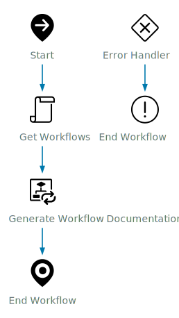

# Automated Documentation for Aria Automation Orchestrator Workflows

This repository provides a compiled Aria Automation Orchestrator (formerly vRealize Orchestrator, vRO) package containing all workflows and actions from the [`source/`](source/) directory, along with automated documentation generation for each workflow. The solution is designed to make your automation self-documenting, visually clear, and easy to maintain.

**Project Repository:** [vro-documentation](https://github.com/RoinGrindwald/vro-documentation)  
**Direct Package Download:** [com.broadcom.pso.vro.documentation.package (v1.2)](https://github.com/RoinGrindwald/vro-documentation/releases/download/v1.2/com.broadcom.pso.vro.documentation.package)

---

## Features

- **Automated Documentation Generation:**  
  Generates Markdown, HTML, and SVG documentation for individual workflows, workflow categories, or all workflows at once.
- **Visual Workflow Diagrams:**  
  Each workflow is documented with a visual SVG schema, using standard Aria Automation Orchestrator workflow icons for clarity.
- **Comprehensive Metadata:**  
  Documentation includes workflow metadata, inputs, outputs, variables, usages, dependencies, and step-by-step breakdowns.
- **Native Orchestrator Integration:**  
  All components are delivered as native Orchestrator workflows and Node.js actions, ready for import and execution.
- **Resource Element Storage:**  
  Generated documentation is stored as Orchestrator Resource Elements for easy retrieval and export.

---

## Prerequisites

To use this solution, your Aria Automation Orchestrator environment must meet the following requirements:

- **Aria Automation Orchestrator Enterprise License:**  
  Required for advanced features such as custom Node.js action environments.
- **Node.js Runtime (v20 recommended):**  
  The included action environment is configured for Node.js 20.
- **Node.js Package Dependencies:**  
  The package uses `node-graphviz` (for rendering diagrams) and `xmldom` (for SVG manipulation). These are managed by the Orchestrator action environment.
- **Git Integration (Recommended):**  
  For version control and collaborative development.

---

## Solution Components

All components are delivered in the `com.broadcom.pso.vro.documentation.package` file:

- **Workflows:**
  - **Generate Workflow Documentation:**  
    Generates documentation for a single workflow and stores it as an Orchestrator Resource Element.
  - **Generate Workflow Category Documentation:**  
    Generates documentation for all workflows within a selected category, storing each as a Resource Element.
  - **Generate All Workflows Documentation:**  
    Generates documentation for all workflows, storing each as a Resource Element. You can exclude the inbuilt Library.

---

## How It Works

1. **Select a Workflow or Category:**  
   Run either the `Generate Workflow Documentation` (for a single workflow), `Generate Workflow Category Documentation` (for all workflows in a category), or `Generate All Workflow Documentation` (for all workflows, with an option to exclude the Library).
2. **Extract Metadata:**  
   The workflow extracts structure and metadata, converting it into a Graphviz DOT string.
3. **Render SVG Diagram:**  
   The DOT string is rendered into an SVG diagram using Node.js actions, with standard Orchestrator workflow icons.
4. **Store Documentation:**  
   The final documentation (Markdown/HTML and SVG) is saved as Orchestrator Resource Elements for easy access and export.

---

## Usage

1. **Import the Orchestrator Package:**  
   Download and import the package into your Aria Automation Orchestrator environment.
2. **Run Documentation Workflows:**  
   - **Generate Workflow Documentation:**  
     Inputs: `workflow`, `type` (Markdown/HTML), `useClarity` (for Clarity CSS), `horizontal` (diagram orientation)
   - **Generate Workflow Category Documentation:**  
     Inputs: `workflowCategory`, `type` (Markdown/HTML), `useClarity` (for Clarity CSS), `horizontal` (diagram orientation)
   - Outputs are stored as Resource Elements.
3. **Export or Use Documentation:**  
   Retrieve the generated Resource Elements or export the Markdown/HTML/SVG files for use in wikis, documentation portals, or as PDFs.

See the [`documentation/`](documentation/) folder for real examples of the generated outputs.

---

## Workflow Inputs and Outputs

| Workflow                         | Inputs                                         | Outputs                          |
|-----------------------------------|------------------------------------------------|-----------------------------------|
| Generate Workflow Documentation   | `workflow`, `type`, `useClarity`, `horizontal` | `workflowDocumentation`           |
| Generate Workflow Category Documentation | `workflowCategory`, `type`, `useClarity`, `horizontal` | `result` (array of ResourceElements) |
| Generate All Workflow Documentation | `includeLibrary`, `type`, `useClarity`, `horizontal` | `result` (array of ResourceElements) |

---

## What Gets Generated

- Markdown and HTML documentation files for each workflow
- SVG diagrams for workflow schemas using Aria Automation Orchestrator workflow icons
- All documentation is stored as Orchestrator Resource Elements

---

## See It In Action

*Above: Automatically generated SVG diagram using Aria Automation Orchestrator workflow icons.*

---

## Explore the Examples

The [`example/`](example/) folder contains a sample workflow that demonstrates every Aria Automation Orchestrator workflow type. For this workflow, you’ll find generated documentation in all supported formats:
- **Markdown:** [`example/Test.md`](example/Test.md)
- **HTML:** [`example/Test.html`](example/Test.html)
- **PDF:** [`example/Test.pdf`](example/Test.pdf)
- **SVG Diagram:** [`example/Test.svg`](example/Test.svg)

Use these files to see exactly how the documentation and diagrams will look for your own workflows.

---

## Quick Start

1. **Download & Import:**  
   [Download the package](https://github.com/RoinGrindwald/vro-documentation/releases/download/v1.2/com.broadcom.pso.vro.documentation.package) and import into Aria Automation Orchestrator.
2. **Run a Workflow:**  
   Launch `Generate Workflow Documentation` or `Generate Workflow Category Documentation` from the Orchestrator client.
3. **View Results:**  
   Find your generated documentation in the Orchestrator Resource Elements or export as Markdown/HTML/SVG.

---

## License

This project is licensed under the MIT License. See [`LICENSE`](LICENSE) for details.

---

## Acknowledgements

- **Graphviz:** Diagram rendering
- **node-graphviz:** Node.js Graphviz integration
- **xmldom:** SVG/XML parsing and manipulation

---

*For more details and examples, see the [`documentation/`](documentation/) and [`example/`](example/) folders.*