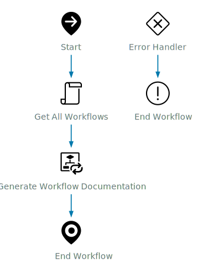

# Workflow Documentation - Generate All Workflow Documentation

## Workflow Overview

<table>
  <tr><th>ID</th><td>b1fbd847-f670-4cd1-a757-074e42f3cfe2</td></tr>
  <tr><th>Description</th><td>This is used to generate documentation for all workflows. However, you can exclude the standard Library so that it will document everything outside the library folder.</td></tr>
  <tr><th>Path</th><td>Library - Custom/Orchestrator/Workflows</td></tr>
  <tr><th>Category</th><td>Workflows</td></tr>
  <tr><th>Version</th><td><code>0.2.0</code></td></tr>
  <tr><th>Author</th><td>System Generated</td></tr>
  <tr><th>Date</th><td>Fri Jun 27 2025 03:43:26 GMT-0000 (GMT)</td></tr>
</table>

## Diagram

[](./Generate_All_Workflow_Documentation.svg)

## Inputs

<table>
<tr><th>Name</th><th>Type</th><th>Description</th><th>Value</th></tr>
<tr><td>includeLibrary</td><td>boolean</td><td>Set to True if you would like to include the inbuilt library workflows.</td><td>-</td></tr>
<tr><td>type</td><td>string</td><td>HTML or Markdown</td><td>-</td></tr>
<tr><td>horizontal</td><td>boolean</td><td>If you want the schema image to be horizontal</td><td>-</td></tr>
<tr><td>asTable</td><td>boolean</td><td>-</td><td>-</td></tr>
</table>

## Outputs

<table>
<tr><th>Name</th><th>Type</th><th>Description</th><th>Value</th></tr>
<tr><td>result</td><td>Array/ResourceElement</td><td>-</td><td>-</td></tr>
</table>

## Attributes (Variables)

| Name | Type | Description | Value |
|:-----|:-----|:-------------|:-------|
| workflows | `Array/Workflow` | Workflows to document | [object Array] |
| errCode | `string` | - |  |


## Usuages

| Name | Type | Location |
|:-----|:-----|:---------|
| com.broadcom.pso.vro.documentation - 8a7484ad96d72cb60196ea5bfbe70139 | `Package` | PACKAGE |


## Dependencies

| Name | Type | Location |
|:-----|:-----|:---------|
| d6e73735-4650-4f8a-b441-d64ed12e8b51 | `Workflow` | SCHEMA - item4 |


## Workflow Steps

<h3><a name='item1'>Get All Workflows [Main path]</a></h3>
<table>
<tr><th>Name</th><td>item1</td></tr>
<tr><th>Display Name</th><td>Get All Workflows</td></tr>
<tr><th>Type</th><td>task</td></tr>
<tr><th>Description</th><td>Simple task with custom script capability.</td></tr>
<tr><th>Error Bind</th><td>errCode</td></tr>
<tr><th>Input Bindings</th><td><table><tr><th>Name</th><th>Type</th><th>Description</th><th>Export Name</th></tr><tr><td>includeLibrary</td><td><code>boolean</code></td><td></td><td>includeLibrary</td></tr></table></td></tr>
<tr><th>Output Bindings</th><td><table><tr><th>Name</th><th>Type</th><th>Description</th><th>Export Name</th></tr><tr><td>workflows</td><td><code>Array/Workflow</code></td><td></td><td>workflows</td></tr></table></td></tr>
<tr><th>Script</th><td class='script'>

```javascript
// Get All Workflow Categories
var categories = Server.getAllWorkflowCategories()

// Array to store all workflows
workflows = new Array();

// Loop through categories and get Workflows. Skip Library if includeLibrary is not true
for each(var category in categories) {
    if (category.name == 'Library' && !includeLibrary) {
        System.log("Skipping [" + category.name + "] because includeLibrary was set to [" + includeLibrary + "]")
    } else {
        System.log("Getting Workflows for [" + category.name + "]")
        var catWorkflows = category.allWorkflows

        if (catWorkflows) {
            System.log("Found [" + catWorkflows.length + "]")
            workflows = workflows.concat(catWorkflows);
        }
    }
}

```

</td></tr>
<tr><th>Used Actions</th><td></td></tr>
</table>


---
<h3><a name='item4'>Generate Workflow Documentation [Main path]</a></h3>
<table>
<tr><th>Name</th><td>item4</td></tr>
<tr><th>Display Name</th><td>Generate Workflow Documentation</td></tr>
<tr><th>Type</th><td>foreach</td></tr>
<tr><th>Description</th><td>No description</td></tr>
<tr><th>Error Bind</th><td>errCode</td></tr>
<tr><th>Input Bindings</th><td><table><tr><th>Name</th><th>Type</th><th>Description</th><th>Export Name</th></tr><tr><td>workflow</td><td><code>Array/Workflow</code></td><td>Workflow</td><td>*workflows</td></tr>
<tr><td>type</td><td><code>string</code></td><td></td><td>type</td></tr>
<tr><td>horizontal</td><td><code>boolean</code></td><td>If you want the schema image to be horizontal</td><td>horizontal</td></tr>
<tr><td>asTable</td><td><code>boolean</code></td><td></td><td>asTable</td></tr></table></td></tr>
<tr><th>Output Bindings</th><td><table><tr><th>Name</th><th>Type</th><th>Description</th><th>Export Name</th></tr><tr><td>workflowDocumenation</td><td><code>Array/ResourceElement</code></td><td></td><td>*result</td></tr></table></td></tr>
<tr><th>Linked Workflow</th><td><table>
<tr><th>Name</th><td>Generate Workflow Documentation</td></tr>
<tr><th>Version</th><td><code>0.2.0</code></td></tr>
<tr><th>ID</th><td>d6e73735-4650-4f8a-b441-d64ed12e8b51</td></tr>
<tr><th>Description</th><td>This is used to generate documentation for a workflow to Resources.</td></tr>
<tr><th>Inputs</th><td><table><tr><th>Name</th><th>Type</th><th>Description</th></tr><tr><td>workflow</td><td><code>Workflow</code></td><td>Workflow</td></tr>
<tr><td>type</td><td><code>string</code></td><td></td></tr>
<tr><td>horizontal</td><td><code>boolean</code></td><td>If you want the schema image to be horizontal</td></tr>
<tr><td>asTable</td><td><code>boolean</code></td><td></td></tr></table></td></tr>
<tr><th>Outputs</th><td><table><tr><th>Name</th><th>Type</th><th>Description</th></tr><tr><td>workflowDocumenation</td><td><code>ResourceElement</code></td><td></td></tr></table></td></tr>
</table></td></tr>
</table>


---
<h3><a name='item0'>End Workflow [Main path]</a></h3>
<table>
<tr><th>Name</th><td>item0</td></tr>
<tr><th>Display Name</th><td>undefined</td></tr>
<tr><th>Type</th><td>end</td></tr>
<tr><th>Description</th><td>No description</td></tr>
<tr><th>Input Bindings</th><td></td></tr>
</table>


---
<h3><a name='item3'>End Workflow [Error Handler path]</a></h3>
<table>
<tr><th>Name</th><td>item3</td></tr>
<tr><th>Display Name</th><td>undefined</td></tr>
<tr><th>Type</th><td>end</td></tr>
<tr><th>Description</th><td>No description</td></tr>
<tr><th>Error Bind</th><td>errCode</td></tr>
<tr><th>Input Bindings</th><td></td></tr>
</table>


---
