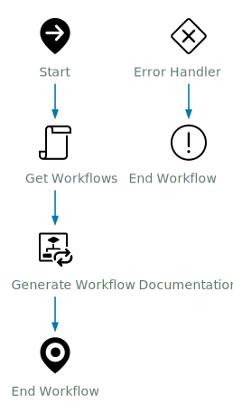

# Workflow Documentation - Generate Workflow Category Documentation

## Workflow Overview

<table>
  <tr><th>ID</th><td>381b57fc-f8ef-4ce5-8a1a-d044c364172c</td></tr>
  <tr><th>Description</th><td>This Workflow is used to document all Workflows from a selected Workflow Category. You can generate the documentation in either a Markdown Format or HTML. If you want to save the page as a PDF, use HTML without Clarity.</td></tr>
  <tr><th>Path</th><td>Library - Custom/Orchestrator/Workflows</td></tr>
  <tr><th>Category</th><td>Workflows</td></tr>
  <tr><th>Version</th><td><code>0.1.0</code></td></tr>
  <tr><th>Author</th><td>System Generated</td></tr>
  <tr><th>Date</th><td>Fri Jun 13 2025 05:06:35 GMT-0000 (GMT)</td></tr>
</table>

## Diagram

[](./Generate_Workflow_Category_Documentation.svg)

## Inputs

| Name | Type | Description |
|:-----|:-----|:-------------|
| workflowCategory | `WorkflowCategory` | Workflow Category you want to Document |
| type | `string` | Markdown or HTML |
| useClarity | `boolean` | If you want to use Clarity CSS for HTML (Requires Internet to load) |
| horizontal | `boolean` | - |


## Outputs

| Name | Type | Description |
|:-----|:-----|:-------------|
| result | `Array/ResourceElement` | Resource Elements that were created |


## Attributes (Variables)

| Name | Type | Description | Value |
|:-----|:-----|:-------------|:-------|
| errCode | `string` | - |  |
| workflows | `Array/Workflow` | Array of Workflows for that category | [object Array] |


## Usuages

| Name | Type | Location |
|:-----|:-----|:---------|
| com.broadcom.pso.vro.documentation - 8a7484ad96d72cb60196ea5bfbe70139 | `Package` | PACKAGE |


## Dependencies

| Name | Type | Location |
|:-----|:-----|:---------|
| d6e73735-4650-4f8a-b441-d64ed12e8b51 | `Workflow` | SCHEMA - item3 |


## Workflow Steps

<h3><a name='item1'>Step 1 - Get Workflows (Main path)</a></h3>
<table class='table'>
<tr><th class=''>Name</th><td class=''>item1</td></tr>
<tr><th class=''>Display Name</th><td class=''>Get Workflows</td></tr>
<tr><th class=''>Type</th><td class=''>task</td></tr>
<tr><th class=''>Description</th><td class=''>Simple task with custom script capability.</td></tr>
<tr><th class=''>Error Bind</th><td class=''>errCode</td></tr>
<tr><th class=''>Script</th><td class='script '>

```javascript
// Get all workflows from the category
workflows = workflowCategory.allWorkflows
```

</td></tr>
<tr><th class=''>Input Bindings</th><td class=''><table class='table'><tr><th>Name</th><th>Type</th><th>Description</th><th>Export Name</th></tr>
<tr><td>workflowCategory</td><td><code>WorkflowCategory</code></td><td></td><td>workflowCategory</td></tr>
</table>
</td></tr>
<tr><th class=''>Output Bindings</th><td class=''><table class='table'><tr><th>Name</th><th>Type</th><th>Description</th><th>Export Name</th></tr>
<tr><td>workflows</td><td><code>Array/Workflow</code></td><td></td><td>workflows</td></tr>
</table>
</td></tr>
</table>

<h3><a name='item3'>Step 2 - Generate Workflow Documentation (Main path)</a></h3>
<table class='table'>
<tr><th class=''>Name</th><td class=''>item3</td></tr>
<tr><th class=''>Display Name</th><td class=''>Generate Workflow Documentation</td></tr>
<tr><th class=''>Type</th><td class=''>foreach</td></tr>
<tr><th class=''>Description</th><td class=''>No description</td></tr>
<tr><th class=''>Error Bind</th><td class=''>errCode</td></tr>
<tr><th class=''>Input Bindings</th><td class=''><table class='table'><tr><th>Name</th><th>Type</th><th>Description</th><th>Export Name</th></tr>
<tr><td>workflow</td><td><code>Array/Workflow</code></td><td>Workflow</td><td>*workflows</td></tr>
<tr><td>type</td><td><code>string</code></td><td></td><td>type</td></tr>
<tr><td>useClarity</td><td><code>boolean</code></td><td>If you want to use Clarity UI (HTML Only)</td><td>useClarity</td></tr>
<tr><td>horizontal</td><td><code>boolean</code></td><td>If you want the schema image to be horizontal</td><td>horizontal</td></tr>
</table>
</td></tr>
<tr><th class=''>Output Bindings</th><td class=''><table class='table'><tr><th>Name</th><th>Type</th><th>Description</th><th>Export Name</th></tr>
<tr><td>workflowDocumenation</td><td><code>Array/ResourceElement</code></td><td></td><td>*result</td></tr>
</table>
</td></tr>
<tr><th class=''>Linked Workflow</th><td class=''><table class='table'>
<tr><th>Name</th><td>Generate Workflow Documentation</td></tr>
<tr><th>Version</th><td><code>0.1.0</code></td></tr>
<tr><th>ID</th><td>d6e73735-4650-4f8a-b441-d64ed12e8b51</td></tr>
<tr><th>Description</th><td>This is used to generate documentation for a workflow to Resources.</td></tr>
<tr><th>Inputs</th><td><table class='table'><tr><th>Name</th><th>Type</th><th>Description</th></tr>
<tr><td>workflow</td><td><code>Workflow</code></td><td>Workflow</td></tr>
<tr><td>type</td><td><code>string</code></td><td></td></tr>
<tr><td>useClarity</td><td><code>boolean</code></td><td>If you want to use Clarity UI (HTML Only)</td></tr>
<tr><td>horizontal</td><td><code>boolean</code></td><td>If you want the schema image to be horizontal</td></tr>
</table></td></tr><tr><th>Outputs</th><td><table class='table'><tr><th>Name</th><th>Type</th><th>Description</th></tr><tr><td>workflowDocumenation</td><td><code>ResourceElement</code></td><td></td></tr>
</table></td></tr>
</table>
</td></tr>
</table>

<h3><a name='item0'>Step 3 - item0 (Main path)</a></h3>
<table class='table'>
<tr><th class=''>Name</th><td class=''>item0</td></tr>
<tr><th class=''>Display Name</th><td class=''>undefined</td></tr>
<tr><th class=''>Type</th><td class=''>end</td></tr>
<tr><th class=''>Description</th><td class=''>No description</td></tr>
</table>

<h3><a name='item2'>Step 4 - item2 (Error Handler path)</a></h3>
<table class='table'>
<tr><th class=''>Name</th><td class=''>item2</td></tr>
<tr><th class=''>Display Name</th><td class=''>undefined</td></tr>
<tr><th class=''>Type</th><td class=''>end</td></tr>
<tr><th class=''>Description</th><td class=''>No description</td></tr>
<tr><th class=''>Error Bind</th><td class=''>errCode</td></tr>
</table>


