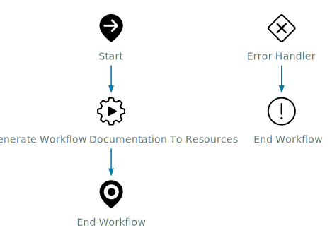

# Workflow Documentation - Generate Workflow Documentation

## Workflow Overview

<table>
  <tr><th>ID</th><td>d6e73735-4650-4f8a-b441-d64ed12e8b51</td></tr>
  <tr><th>Description</th><td>This is used to generate documentation for a workflow to Resources.</td></tr>
  <tr><th>Path</th><td>Library - Custom/Orchestrator/Workflows</td></tr>
  <tr><th>Category</th><td>Workflows</td></tr>
  <tr><th>Version</th><td><code>0.1.0</code></td></tr>
  <tr><th>Author</th><td>System Generated</td></tr>
  <tr><th>Date</th><td>Fri Jun 13 2025 05:06:44 GMT-0000 (GMT)</td></tr>
</table>

## Diagram

[](./Generate_Workflow_Documentation.svg)

## Inputs

| Name | Type | Description |
|:-----|:-----|:-------------|
| workflow | `Workflow` | Workflow |
| type | `string` | - |
| useClarity | `boolean` | If you want to use Clarity UI (HTML Only) |
| horizontal | `boolean` | If you want the schema image to be horizontal |


## Outputs

| Name | Type | Description |
|:-----|:-----|:-------------|
| workflowDocumenation | `ResourceElement` | - |


## Attributes (Variables)

| Name | Type | Description | Value |
|:-----|:-----|:-------------|:-------|
| errCode | `string` | - |  |


## Usuages

| Name | Type | Location |
|:-----|:-----|:---------|
| com.broadcom.pso.vro.documentation - 8a7484ad96d72cb60196ea5bfbe70139 | `Package` | PACKAGE |
| Generate Workflow Category Documentation - 381b57fc-f8ef-4ce5-8a1a-d044c364172c | `Workflow` | SCHEMA - item3 |


## Dependencies

| Name | Type | Location |
|:-----|:-----|:---------|
| com.broadcom.pso.vro.rest.documentation/generateWorkflowDocumentationToResources | `ScriptModule` | SCHEMA - item1 |


## Workflow Steps

<h3><a name='item1'>Step 1 - Generate Workflow Documentation To Resources (Main path)</a></h3>
<table class='table'>
<tr><th class=''>Name</th><td class=''>item1</td></tr>
<tr><th class=''>Display Name</th><td class=''>Generate Workflow Documentation To Resources</td></tr>
<tr><th class=''>Type</th><td class=''>task</td></tr>
<tr><th class=''>Description</th><td class=''>Add a note to the workflow schema.</td></tr>
<tr><th class=''>Script Module</th><td class=''>com.broadcom.pso.vro.rest.documentation/generateWorkflowDocumentationToResources</td></tr>
<tr><th class=''>Error Bind</th><td class=''>errCode</td></tr>
<tr><th class=''>Script</th><td class='script '>

```javascript
//Auto generated script, cannot be modified !
actionResult = System.getModule("com.broadcom.pso.vro.rest.documentation").generateWorkflowDocumentationToResources(workflow,useClarity,type,horizontal);

```

</td></tr>
<tr><th class=''>Input Bindings</th><td class=''><table class='table'><tr><th>Name</th><th>Type</th><th>Description</th><th>Export Name</th></tr>
<tr><td>workflow</td><td><code>Workflow</code></td><td>Workflow</td><td>workflow</td></tr>
<tr><td>useClarity</td><td><code>boolean</code></td><td></td><td>useClarity</td></tr>
<tr><td>type</td><td><code>string</code></td><td>HTML or Markdown</td><td>type</td></tr>
<tr><td>horizontal</td><td><code>boolean</code></td><td>If you want the schema image to be horizontal</td><td>horizontal</td></tr>
</table>
</td></tr>
<tr><th class=''>Output Bindings</th><td class=''><table class='table'><tr><th>Name</th><th>Type</th><th>Description</th><th>Export Name</th></tr>
<tr><td>actionResult</td><td><code>ResourceElement</code></td><td></td><td>workflowDocumenation</td></tr>
</table>
</td></tr>
<tr><th class=''>Used Actions</th><td class=''><table class='table'>
<tr><th>Name</th><td>generateWorkflowDocumentationToResources</td></tr>
<tr><th>Module</th><td>com.broadcom.pso.vro.rest.documentation</td></tr>
<tr><th>ID</th><td>dd68a9d5-3c52-4593-b1e9-01dce27727ce</td></tr>
<tr><th>Version</th><td><code>0.1.0</code></td></tr>
<tr><th>Description</th><td>No description</td></tr>
<tr><th>Inputs</th><td><table class='table'><tr><th>Name</th><th>Type</th><th>Description</th></tr>
<tr><td>workflow</td><td><code>Workflow</code></td><td>Workflow</td></tr>
<tr><td>useClarity</td><td><code>boolean</code></td><td></td></tr>
<tr><td>type</td><td><code>string</code></td><td>HTML or Markdown</td></tr>
<tr><td>horizontal</td><td><code>boolean</code></td><td>If you want the schema image to be horizontal</td></tr>
</table></td></tr>
<tr><th>Output</th><td>ResourceElement</td></tr>
<tr><th>Runtime Environment</th><td>Javascript</td></tr>
<tr><th>Script</th><td class='script'>

```javascript
// Generate the documenation
var documentation = System.getModule("com.broadcom.pso.vro.rest.documentation").generateWorkflowDocumentation(workflow.id, type, useClarity, null, horizontal);

// Setup the file name
var fileName = workflow.name.replace(/ /g, '_') + '.' + (type.toLocaleLowerCase() == 'markdown' ? 'md' : 'html')
var svgName = workflow.name.replace(/ /g, '_') + '.svg'

// Create the resource
var resourceElement = System.getModule("com.broadcom.pso.vro.resource").getOrCreateResourceElement('Documentation/Workflow/' + workflow.workflowCategory.path, fileName);

// Update type and version to be tracked in git
System.getModule("com.broadcom.pso.vro.resource").updateResourceElementByMimeAttachement(resourceElement, documentation, 'text/html')
System.getModule("com.broadcom.pso.vro.rest.resource").updateResourceForGitTracking(resourceElement)

// Generate the Schema image and save as a resource
if (type == 'markdown') {
    var svgFile = System.getModule("com.broadcom.pso.vro.rest.workflow").generateWorkflowSchema(workflow.id, false, horizontal);

    var svgResourceElement = System.getModule("com.broadcom.pso.vro.resource").getOrCreateResourceElement('Documentation/Workflow/' + workflow.workflowCategory.path, svgName);
    System.getModule("com.broadcom.pso.vro.resource").updateResourceElementByMimeAttachement(svgResourceElement, svgFile, 'image/svg+xml')
    System.getModule("com.broadcom.pso.vro.rest.resource").updateResourceForGitTracking(svgResourceElement)
}

return resourceElement
```

</td></tr>
</table><br>
<table class='table'>
<tr><th>Name</th><td>generateWorkflowDocumentation</td></tr>
<tr><th>Module</th><td>com.broadcom.pso.vro.rest.documentation</td></tr>
<tr><th>ID</th><td>01b36113-3fe1-4ce6-9d51-a06dd0e852d4</td></tr>
<tr><th>Version</th><td><code>0.1.0</code></td></tr>
<tr><th>Description</th><td>No description</td></tr>
<tr><th>Inputs</th><td><table class='table'><tr><th>Name</th><th>Type</th><th>Description</th></tr>
<tr><td>workflowId</td><td><code>string</code></td><td>Workflow ID</td></tr>
<tr><td>type</td><td><code>string</code></td><td>Output type: "html" or "markdown"</td></tr>
<tr><td>useClarity</td><td><code>boolean</code></td><td>Whether to include Clarity UI (used only if type is "html")</td></tr>
<tr><td>author</td><td><code>string</code></td><td>(Optional) Author</td></tr>
<tr><td>horizontal</td><td><code>boolean</code></td><td>If you want the schema image to be horizontal</td></tr>
</table></td></tr>
<tr><th>Output</th><td>string</td></tr>
<tr><th>Runtime Environment</th><td>Javascript</td></tr>
<tr><th>Script</th><td class='script'>

```javascript

var workflow = Server.getWorkflowWithId(workflowId);
if (!workflow) {
    throw "Workflow not found with the provided ID: " + workflowId;
}

var workflowObject = System.getModule("com.broadcom.pso.vro.rest.workflow").getWorkflowContent(workflowId);
workflowObject = System.getModule("com.broadcom.pso.vro.rest.documentation.util").enrichWorkflowItems(workflowObject, workflow.items);

var renderedSteps = [];
var workflowLinks = [];
var visited = {};
var stepCounter = 1;

walk(workflowObject['root-name'], "Main", type);

if (workflowObject['error-handler']) {
    workflowObject['error-handler'].forEach(function (e) {
        walk(e.name, 'Error Handler', type);
    });
}

var renderCtx = {
    workflow: workflow,
    usages: System.getModule("com.broadcom.pso.vro.rest.workflow").getWorkflowUsages(workflowId),
    dependencies: System.getModule("com.broadcom.pso.vro.rest.workflow").getWorkflowDependencies(workflowId),
    author: author,
    type: type,
    useClarity: useClarity,
    steps: renderedSteps.join('\n'),
    navLinks: workflowLinks.join('\n'),
    diagram: ((type === 'markdown')
        ? ""
        : System.getModule("com.broadcom.pso.vro.rest.workflow").generateWorkflowSchema(workflowId, false, horizontal)
    )
};

var html = (type === "markdown")
    ? System.getModule("com.broadcom.pso.vro.rest.documentation.util").renderMarkdownDoc(renderCtx)
    : System.getModule("com.broadcom.pso.vro.rest.documentation.util").renderHtmlDoc(useClarity, renderCtx);

System.log("Generated documentation for workflow: " + workflow.name);
return html;


//*************************FUNCTIONS*************************

function walk(itemName, pathLabel, formatType) {
    if (visited[itemName]) return;
    visited[itemName] = true;
    var item = findItemByName(itemName, workflowObject);
    if (!item) return;

    var html = System.getModule("com.broadcom.pso.vro.rest.documentation.util").renderWorkflowStep(item, pathLabel, stepCounter++, useClarity, formatType);
    renderedSteps.push(html.section);
    workflowLinks.push(html.link);

    // Branching logic
    var type = item.type;
    if (type === 'condition' || type === 'custom-condition' || type === 'decision-activity') {
        if (item['out-name']) walk(item['out-name'], "True (" + item['display-name'] + ")", formatType);
        if (item['alt-out-name']) walk(item['alt-out-name'], "False (" + item['display-name'] + ")", formatType);
    } else if (type === 'switch') {
        (item.condition || []).forEach(function (c) {
            walk(c.label, c.value || pathLabel, formatType);
        });
    } else {
        if (item['out-name']) walk(item['out-name'], pathLabel, formatType);
        if (item['catch-name']) walk(item['catch-name'], "Catch", formatType);
    }
}

function findItemByName(name, apiData) {
    var items = apiData["workflow-item"];
    if (!items || !(items instanceof Array)) return null;
    for (var i = 0; i < items.length; i++) {
        if (items[i].name === name) return items[i];
    }
    return null;
}
```

</td></tr>
</table><br>
<table class='table'>
<tr><th>Name</th><td>getWorkflowContent</td></tr>
<tr><th>Module</th><td>com.broadcom.pso.vro.rest.workflow</td></tr>
<tr><th>ID</th><td>11f43dd2-ee16-462c-80ce-df01e1ff7251</td></tr>
<tr><th>Version</th><td><code>0.1.0</code></td></tr>
<tr><th>Description</th><td>No description</td></tr>
<tr><th>Inputs</th><td><table class='table'><tr><th>Name</th><th>Type</th><th>Description</th></tr>
<tr><td>workflowId</td><td><code>string</code></td><td>Workflow ID</td></tr>
<tr><td>query</td><td><code>string</code></td><td>(Optional) Additional Parameters</td></tr>
<tr><td>apiVersion</td><td><code>string</code></td><td>(Optional) Override the default API Version</td></tr>
</table></td></tr>
<tr><th>Output</th><td>Properties</td></tr>
<tr><th>Runtime Environment</th><td>Javascript</td></tr>
<tr><th>Script</th><td class='script'>

```javascript
// Use API Version if passed, else set API Version
apiVersion = apiVersion ? apiVersion : '2021-07-15'

// Build API Call
var path = '/api/workflows/' + workflowId + '/content/';
var query = encodeURI('?apiVersion=' + apiVersion + (query ? '&' + query : ''))
var url = path + query

// Execute API call and return results
return System.getModule("com.broadcom.pso.vro.rest.methods").get(url);
```

</td></tr>
</table><br>
<table class='table'>
<tr><th>Name</th><td>get</td></tr>
<tr><th>Module</th><td>com.broadcom.pso.vro.rest.methods</td></tr>
<tr><th>ID</th><td>da340f7f-7476-4199-a61d-39118da3df9b</td></tr>
<tr><th>Version</th><td><code>0.1.0</code></td></tr>
<tr><th>Description</th><td>No description</td></tr>
<tr><th>Inputs</th><td><table class='table'><tr><th>Name</th><th>Type</th><th>Description</th></tr>
<tr><td>url</td><td><code>string</code></td><td>URL</td></tr>
<tr><td>headers</td><td><code>Properties</code></td><td>(Optional) Headers</td></tr>
</table></td></tr>
<tr><th>Output</th><td>Properties</td></tr>
<tr><th>Runtime Environment</th><td>Javascript</td></tr>
<tr><th>Script</th><td class='script'>

```javascript
// Set method
var method = 'GET';

// If headers is supplied, use headers else generate an empty property
headers = headers ? headers : new Properties();

// Return the Results
return System.getModule("com.broadcom.pso.vro.rest.methods").restOperation(method, url, null, headers);
```

</td></tr>
</table><br>
<table class='table'>
<tr><th>Name</th><td>restOperation</td></tr>
<tr><th>Module</th><td>com.broadcom.pso.vro.rest.methods</td></tr>
<tr><th>ID</th><td>fe2b6be2-7f09-4877-b915-cee0c5c714c4</td></tr>
<tr><th>Version</th><td><code>0.1.0</code></td></tr>
<tr><th>Description</th><td>No description</td></tr>
<tr><th>Inputs</th><td><table class='table'><tr><th>Name</th><th>Type</th><th>Description</th></tr>
<tr><td>method</td><td><code>string</code></td><td>Method</td></tr>
<tr><td>url</td><td><code>string</code></td><td>URL</td></tr>
<tr><td>content</td><td><code>string</code></td><td>Content</td></tr>
<tr><td>headers</td><td><code>Properties</code></td><td>(Optional) Headers</td></tr>
</table></td></tr>
<tr><th>Output</th><td>Properties</td></tr>
<tr><th>Runtime Environment</th><td>Javascript</td></tr>
<tr><th>Script</th><td class='script'>

```javascript
try {
    // Get vRO URL and token
    var connectionDetails = System.getModule("com.broadcom.pso.vro.rest.methods").getLocalConnectionDetails();
    var vroUrl = connectionDetails.get("vcoUrl");
    var token = connectionDetails.get("token");

    if (!vroUrl || !token) {
        throw "Missing vRO URL or token from connectionDetails.";
    }

    // Create transient REST host
    var restHost = RESTHostManager.createHost("DynamicVroHost");
    var transientHost = RESTHostManager.createTransientHostFrom(restHost);
    transientHost.url = vroUrl;

    // Build request
    var request = transientHost.createRequest(method, url, content);
    request.contentType = "application/json";
    request.setHeader("Accept", "application/json");
    request.setHeader("ContentType", "application/json");
    request.setHeader("Authorization", "Bearer " + token);
    
    // If there is headers, add headers
    if (System.getObjectType(headers) == 'Properties') {
        for (i in headers) {
            request.setHeader(i, headers[i])
        }
    }

    System.log("Executing request to: " + transientHost.url + url);

    // Execute request
    var result = request.execute();

    System.log(
        "\nURL: " + transientHost.url + url +
        "\nMethod: " + method +
        "\nStatus: " + result.statusCode +
        "\nResponse: " + result.contentAsString
    );

    if (result.statusCode >= 400) {
        throw "Request failed: " + method + " " + url + " — status: " + result.statusCode + " — content: " + result.contentAsString;
    }

    // Handle empty response
    if (result.contentLength === 0 || !result.contentAsString) {
        return new Properties();
    }

    // Attempt to parse JSON
    var parsed;
    try {
        parsed = JSON.parse(result.contentAsString);
    } catch (e) {
        System.log("Non-JSON response. Returning raw content.");
        return {
            headers: result.getAllHeaders(),
            content: result.contentAsString
        };
    }

    // Return based on parsed type
    if (parsed instanceof Array) {
        return {
            content: parsed
        };
    } else if (parsed instanceof Object) {
        return parsed;
    } else {
        return {
            content: parsed
        };
    }

} catch (e) {
    throw "Unable to execute REST request: " + e;
}
```

</td></tr>
</table><br>
<table class='table'>
<tr><th>Name</th><td>getLocalConnectionDetails</td></tr>
<tr><th>Module</th><td>com.broadcom.pso.vro.rest.methods</td></tr>
<tr><th>ID</th><td>68d878f0-2e32-4b25-9934-3a8b960a0e29</td></tr>
<tr><th>Version</th><td><code>0.1.0</code></td></tr>
<tr><th>Description</th><td>No description</td></tr>
<tr><th>Inputs</th><td><table class='table'><tr><th>Name</th><th>Type</th><th>Description</th></tr>
</table></td></tr>
<tr><th>Output</th><td>Properties</td></tr>
<tr><th>Runtime Environment</th><td>python:3.10</td></tr>
<tr><th>Script</th><td class='script'>

```python
def handler(context, inputs):
    outputs = {}
    outputs['vcoUrl'] = context['vcoUrl']
    outputs['token'] = context['getToken']()
    return outputs
```

</td></tr>
</table><br>
<table class='table'>
<tr><th>Name</th><td>enrichWorkflowItems</td></tr>
<tr><th>Module</th><td>com.broadcom.pso.vro.rest.documentation.util</td></tr>
<tr><th>ID</th><td>e4f7623c-7048-443f-8826-fd8a4c805cea</td></tr>
<tr><th>Version</th><td><code>0.1.0</code></td></tr>
<tr><th>Description</th><td>No description</td></tr>
<tr><th>Inputs</th><td><table class='table'><tr><th>Name</th><th>Type</th><th>Description</th></tr>
<tr><td>apiData</td><td><code>Properties</code></td><td>API Data</td></tr>
<tr><td>workflowItems</td><td><code>Array/Any</code></td><td>Workflow Items</td></tr>
</table></td></tr>
<tr><th>Output</th><td>Properties</td></tr>
<tr><th>Runtime Environment</th><td>Javascript</td></tr>
<tr><th>Script</th><td class='script'>

```javascript
// Mapping vRO WorkflowItem types to API type strings
var typeMapping = {
    "WorkflowTaskItem": "task",
    "WorkflowEndItem": "end",
    "WorkflowLinkItem": "link",
    "WorkflowCustomConditionItem": "custom-condition",
    "WorkflowGenericConditionItem": "condition",
    "WorkflowSwitchItem": "switch",
    "WorkflowForeachItem": "foreach",
    "WorkflowMultipleCallItem": "multiple",
    "WorkflowItemWaitingTimer": "waiting-timer"
};

// Main loop through each API workflow item
for (var k = 0; k < apiData['workflow-item'].length; k++) {
    var apiItem = apiData['workflow-item'][k];

    // Iterate over vRO workflowItems to find a matching item
    for (var i = 0; i < workflowItems.length; i++) {
        var workflowItem = workflowItems[i];

        // Get the inferred type based on the WorkflowItem's constructor name
        var inferredType = typeMapping[workflowItem.constructor.name];

        // Match on display-name and type to ensure accurate mapping
        if (workflowItem.name === apiItem['display-name'] && inferredType === apiItem.type) {
            // Handle WorkflowSwitchItems, WorkflowCustomConditionItems, and WorkflowGenericConditionItems
            if ((workflowItem.constructor.name === "WorkflowSwitchItem" && apiItem.type === "switch") ||
                ((workflowItem.constructor.name === "WorkflowCustomConditionItem" && apiItem.type === "custom-condition" || workflowItem.constructor.name === "WorkflowGenericConditionItem") && apiItem.type === "condition")) {

                if (workflowItem.constructor.name === "WorkflowSwitchItem") {
                    if (allOutItemsMatch(apiItem.condition, workflowItem.outItems)) {
                        apiItem['item'] = workflowItem; // Assign switch only if outItems match
                    }
                } else {
                    if (conditionMatches(apiItem, workflowItem)) {
                        apiItem['item'] = workflowItem; // Assign condition only if true/false paths match
                    }
                }

            } else {
                // For other item types, assign the vRO WorkflowItem directly
                apiItem['item'] = workflowItem
            }
            break; // Move to the next API item once a match is found
        }
    }
}

return apiData; // Return the enriched API data with added workflow item details

// Helper function to find the display-name for an item based on its unique name (e.g., "item3")
function findDisplayNameByUniqueName(uniqueName, apiData) {
    for (var j = 0; j < apiData['workflow-item'].length; j++) {
        var item = apiData['workflow-item'][j];
        if (item.name === uniqueName) {
            return item['display-name'];
        }
    }
    return null;
}

// Function to check if nextItemTrue and nextItemFalse match API out-name and alt-out-name
function conditionMatches(apiItem, workflowConditionItem) {
    var nextTrueName = workflowConditionItem.nextItemTrue ? workflowConditionItem.nextItemTrue.name : null;
    var nextFalseName = workflowConditionItem.nextItemFalse ? workflowConditionItem.nextItemFalse.name : null;

    var expectedTrueName = findDisplayNameByUniqueName(apiItem['out-name'], apiData);
    var expectedFalseName = findDisplayNameByUniqueName(apiItem['alt-out-name'], apiData);

    return (nextTrueName === expectedTrueName) && (nextFalseName === expectedFalseName);
}

// Function to check if all outItems match the API condition labels for switches
function allOutItemsMatch(apiConditions, workflowOutItems) {
    if (apiConditions.length !== workflowOutItems.length) {
        return false;
    }

    for (var i = 0; i < apiConditions.length; i++) {
        var conditionLabel = apiConditions[i].label;
        var expectedDisplayName = findDisplayNameByUniqueName(conditionLabel, apiData);

        if (expectedDisplayName !== workflowOutItems[i].name) {
            return false; // Exit if any label does not match
        }
    }

    return true; // Return true only if all items match
}
```

</td></tr>
</table><br>
<table class='table'>
<tr><th>Name</th><td>getWorkflowUsages</td></tr>
<tr><th>Module</th><td>com.broadcom.pso.vro.rest.workflow</td></tr>
<tr><th>ID</th><td>a0055e02-9260-4e84-999e-ca00377c68d6</td></tr>
<tr><th>Version</th><td><code>0.1.0</code></td></tr>
<tr><th>Description</th><td>No description</td></tr>
<tr><th>Inputs</th><td><table class='table'><tr><th>Name</th><th>Type</th><th>Description</th></tr>
<tr><td>workflowId</td><td><code>string</code></td><td>Workflow ID</td></tr>
<tr><td>query</td><td><code>string</code></td><td>(Optional) Additional Parameters</td></tr>
<tr><td>apiVersion</td><td><code>string</code></td><td>(Optional) Override the default API Version</td></tr>
</table></td></tr>
<tr><th>Output</th><td>Array/Properties</td></tr>
<tr><th>Runtime Environment</th><td>Javascript</td></tr>
<tr><th>Script</th><td class='script'>

```javascript
// Use API Version if passed, else set API Version
apiVersion = apiVersion ? apiVersion : '2021-07-15'

// Build API Call
var path = '/api/workflows/' + workflowId + '/usages';
var query = encodeURI('?apiVersion=' + apiVersion + (query ? '&' + query : ''))
var url = path + query

// Execute API call and return results
var results = System.getModule("com.broadcom.pso.vro.rest.methods").get(url);

// Convert Reference to a single Array object
return System.getModule("com.broadcom.pso.vro.util").convertNestedReferences(results);
```

</td></tr>
</table><br>
<table class='table'>
<tr><th>Name</th><td>convertNestedReferences</td></tr>
<tr><th>Module</th><td>com.broadcom.pso.vro.util</td></tr>
<tr><th>ID</th><td>6ea2bfae-304a-4fb2-90fa-399fd7829432</td></tr>
<tr><th>Version</th><td><code>0.1.0</code></td></tr>
<tr><th>Description</th><td>No description</td></tr>
<tr><th>Inputs</th><td><table class='table'><tr><th>Name</th><th>Type</th><th>Description</th></tr>
<tr><td>referenceObject</td><td><code>Properties</code></td><td>API Reference Object</td></tr>
</table></td></tr>
<tr><th>Output</th><td>Array/Properties</td></tr>
<tr><th>Runtime Environment</th><td>Javascript</td></tr>
<tr><th>Script</th><td class='script'>

```javascript
// Convert nested 'references' structure to a flat array of Properties
var result = [];

// Get the 'references' array from the input object
var references = referenceObject['references'];

for (var i = 0; i < references.length; i++) {
    var ref = references[i].reference;
    
    var prop = new Properties();
    for (var key in ref) {
        if (ref.hasOwnProperty(key)) {
            prop.put(key, ref[key]);
        }
    }
    
    result.push(prop);
}

return result;

```

</td></tr>
</table><br>
<table class='table'>
<tr><th>Name</th><td>getWorkflowDependencies</td></tr>
<tr><th>Module</th><td>com.broadcom.pso.vro.rest.workflow</td></tr>
<tr><th>ID</th><td>022d7341-fea8-40da-bb59-f900d920fa49</td></tr>
<tr><th>Version</th><td><code>0.1.0</code></td></tr>
<tr><th>Description</th><td>No description</td></tr>
<tr><th>Inputs</th><td><table class='table'><tr><th>Name</th><th>Type</th><th>Description</th></tr>
<tr><td>workflowId</td><td><code>string</code></td><td>Workflow ID</td></tr>
<tr><td>query</td><td><code>string</code></td><td>(Optional) Additional Parameters</td></tr>
<tr><td>apiVersion</td><td><code>string</code></td><td>(Optional) Override the default API Version</td></tr>
</table></td></tr>
<tr><th>Output</th><td>Array/Properties</td></tr>
<tr><th>Runtime Environment</th><td>Javascript</td></tr>
<tr><th>Script</th><td class='script'>

```javascript
// Use API Version if passed, else set API Version
apiVersion = apiVersion ? apiVersion : '2021-07-15'

// Build API Call
var path = '/api/workflows/' + workflowId + '/dependencies';
var query = encodeURI('?apiVersion=' + apiVersion + (query ? '&' + query : ''))
var url = path + query

// Execute API call and return results
var results = System.getModule("com.broadcom.pso.vro.rest.methods").get(url);

// Convert Reference to a single Array object
return System.getModule("com.broadcom.pso.vro.util").convertNestedReferences(results);
```

</td></tr>
</table><br>
<table class='table'>
<tr><th>Name</th><td>generateWorkflowSchema</td></tr>
<tr><th>Module</th><td>com.broadcom.pso.vro.rest.workflow</td></tr>
<tr><th>ID</th><td>2b3cf51c-4e50-4433-9ed3-483da8f091af</td></tr>
<tr><th>Version</th><td><code>0.1.0</code></td></tr>
<tr><th>Description</th><td>No description</td></tr>
<tr><th>Inputs</th><td><table class='table'><tr><th>Name</th><th>Type</th><th>Description</th></tr>
<tr><td>workflowId</td><td><code>string</code></td><td>Workflow ID</td></tr>
<tr><td>removeHeightAndWidth</td><td><code>boolean</code></td><td>If you want to remove the height and width from the SVG</td></tr>
<tr><td>horizontal</td><td><code>boolean</code></td><td>If you want the image to be horizontal</td></tr>
</table></td></tr>
<tr><th>Output</th><td>string</td></tr>
<tr><th>Runtime Environment</th><td>Javascript</td></tr>
<tr><th>Script</th><td class='script'>

```javascript
// Get Workflow in GraphViz
var dotGraph = System.getModule("com.broadcom.pso.vro.rest.workflow").generateDotGraphFromWorkflow(workflowId, horizontal);

// Render dotGraph to SVG
var svg = System.getModule("com.broadcom.pso.graphviz").renderGraphvizDot(dotGraph);

// Get Icon Json
var icons = System.getModule("com.broadcom.pso.vro.resource").getOrCreateResourceElement('Documentation/Config', 'icon.json').getContentAsMimeAttachment().content;

// Update SVG with Icons
svg = System.getModule("com.broadcom.pso.graphviz").postProcessGraphSvgWithIcons(svg, icons);

//Return
if (removeHeightAndWidth) {
    return adjustSvgDimensions(svg)
} else {
    return svg
}

function adjustSvgDimensions(svgText) {
    // Use a regex to replace width and height in the opening <svg ... > tag
    return svgText.replace(/<svg[^>]*width="[^"]*"[^>]*height="[^"]*"/,
        function (match) {
            return match
                .replace(/width="[^"]*"/, '')
                .replace(/height="[^"]*"/, '');
        });
}

```

</td></tr>
</table><br>
<table class='table'>
<tr><th>Name</th><td>generateDotGraphFromWorkflow</td></tr>
<tr><th>Module</th><td>com.broadcom.pso.vro.rest.workflow</td></tr>
<tr><th>ID</th><td>7f201ef7-3753-413d-b146-fede586bf369</td></tr>
<tr><th>Version</th><td><code>0.1.0</code></td></tr>
<tr><th>Description</th><td>No description</td></tr>
<tr><th>Inputs</th><td><table class='table'><tr><th>Name</th><th>Type</th><th>Description</th></tr>
<tr><td>workflowId</td><td><code>string</code></td><td>Workflow ID</td></tr>
<tr><td>horizontal</td><td><code>boolean</code></td><td>If you want the graph to be horizontal</td></tr>
</table></td></tr>
<tr><th>Output</th><td>string</td></tr>
<tr><th>Runtime Environment</th><td>Javascript</td></tr>
<tr><th>Script</th><td class='script'>

```javascript
var workflowContent = System.getModule("com.broadcom.pso.vro.rest.workflow").getWorkflowContent(workflowId);
var styleMap = JSON.parse(System.getModule("com.broadcom.pso.vro.resource").getOrCreateResourceElement('Documentation/Config', 'workflow-style.json').getContentAsMimeAttachment().content);
var items = workflowContent["workflow-item"];
var output = [];
var edges = [];

output.push('digraph WorkflowGraph {');
output.push('    graph [bgcolor="none", fontname="Calibri", compound="true", nodesep=1, fontcolor="#6a7a81"]; ' + (horizontal ? 'rankdir="LR";' : ''));
output.push('    node [fontname="Calibri", penwidth="2", color="#6a7a81"];');
output.push('    edge [fontname="Calibri", color="#0079ad", penwidth=1.6, arrowsize=.8, headclip="false", minlen=2, fontcolor="#6a7a81"];');

// Add Start
// Ensure the 'start' item object always has a 'type' property
addSubgraphItem(
    'workflow_start',
    'start',
    workflowContent["root-name"],
    { type: 'start', position: workflowContent.position }, // 'type' is explicitly set here
    output,
    edges,
    styleMap
);

// Error Handler
if (workflowContent.hasOwnProperty('error-handler') && workflowContent['error-handler'].length > 0) {
    var errorHandlerItem = workflowContent['error-handler'][0];

    if (!errorHandlerItem.type) {
        errorHandlerItem.type = 'error-handler'; // Assign the correct type for consistent processing
    }
    addSubgraphItem(
        'error_handler',
        'errorHandler',
        errorHandlerItem['name'],
        errorHandlerItem, // Pass the potentially modified item
        output,
        edges,
        styleMap
    );
}

for (var i = 0; i < items.length; i++) {
    var item = items[i];
    var name = item.name;
    var type = item.type;
    var label = item["display-name"] || type;
    var tooltip = label;
    var href = "#" + name;
    var pos = item.position ? item.position.x + "," + item.position.y : "0,0";

    var nodeId = getNodeId(item);

    var style;
    if (type === "start") {
        style = styleMap["start"];
    } else if (type === "end" && item["end-mode"] !== undefined) {
        style = styleMap["end"][item["end-mode"]] || styleMap["end"];
    } else if (type === "error-handler" || type === "error-item") {
        style = styleMap["error_handler"];
    } else {
        style = styleMap["default"];
    }
    style = style || {};

    output.push('    subgraph "cluster_' + name + '" {');

    if (style.subgraph) {
        output.push('        id="' + nodeId + '";');
        output.push('        href="' + href + '";');
        output.push('        tooltip="' + tooltip + '";');
        for (var k in style.subgraph) {
            if (k !== "label" && k !== "tooltip" && k !== "href" && k !== "id") {
                output.push('        ' + k + '="' + style.subgraph[k] + '";');
            }
        }
        if (style.subgraph.label) {
            output.push('        label="' + style.subgraph.label + '";');
        } else {
            output.push('        label="' + label + '";');
        }
        if (style.subgraph.tooltip) {
            output.push('        tooltip="' + tooltip + '";');
        }
    }

    var nodeDef = '        ' + name + ' [id="' + nodeId + '", ';
    var props = [];
    if (style.node) {
        for (var k in style.node) {
            var val = style.node[k];
            if (k === "label" && typeof val === "string" && val.trim().charAt(0) === "<") {
                props.push(k + '=' + val);
            } else {
                props.push(k + '="' + val + '"');
            }
        }
    }
    props.push('tooltip="' + tooltip + '"');
    props.push('href="' + href + '"');
    props.push('pos="' + pos + '"');
    nodeDef += props.join(', ') + '];';
    output.push(nodeDef);
    output.push('    }');

    if (item["out-name"] && type === "custom-condition") {
        edges.push('    ' + name + ' -> ' + item["out-name"] + ' [color="#41800e", ltail="cluster_' + name + '", lhead="cluster_' + item["out-name"] + '"];');
    } else if (item["out-name"]) {
        edges.push('    ' + name + ' -> ' + item["out-name"] + ' [ltail="cluster_' + name + '", lhead="cluster_' + item["out-name"] + '"];');
    }
    if (item["alt-out-name"]) {
        edges.push('    ' + name + ' -> ' + item["alt-out-name"] + ' [color="#e02100", style=dashed, ltail="cluster_' + name + '", lhead="cluster_' + item["alt-out-name"] + '"];');
    }

    if (item["catch-name"]) {
        edges.push('    ' + name + ' -> ' + item["catch-name"] + ' [color="#e02100", style=dashed, ltail="cluster_' + name + '", lhead="cluster_' + item["catch-name"] + '"];');
    }

    if (type === "switch" && item.condition && item.condition.length > 0) {
        for (var c = 0; c < item.condition.length; c++) {
            var labelTarget = item.condition[c].label;
            if (labelTarget) {
                edges.push('    ' + name + ' -> ' + labelTarget + ' [ltail="cluster_' + name + '", lhead="cluster_' + labelTarget + '"];');
            }
        }
    }
}

for (var j = 0; j < edges.length; j++) {
    output.push(edges[j]);
}

output.push('}');
var finalDotGraph = output.join('\n');
System.debug(finalDotGraph);
return finalDotGraph;


// --- Helper Functions ---

function getNodeId(item) {
    var type = item.type;
    var script = (item.script && item.script.value) ? item.script.value : "";
    var prototypeId = item["prototype-id"] || "";
    var scriptModule = item["script-module"] || "";

    if (type === "end") {
        if (item["end-mode"] !== undefined) {
            if (item["end-mode"] === "0") {
                return "end";
            } else if (item["end-mode"] === "1") {
                return "exception";
            }
        }
    }
    if (script.indexOf("workflowToLaunch.schedule") !== -1) {
        return "workflow-schedule";
    }
    if (script.indexOf("workflowToLaunch.execute") !== -1) {
        return "workflow-async";
    }
    if (prototypeId) {
        return prototypeId;
    }
    if (scriptModule) {
        return "scripting-element";
    }
    if (type === "start") {
        return "start";
    }
    if (type === "error-handler" || type === "error-item") {
        return "error-handler";
    }

    // Fallback to the general item type
    return type;
}

function addSubgraphItem(subgraphName, nodeName, linkTarget, itemObject, outputArray, edgeArray, styleMap) {
    var nodeId = getNodeId(itemObject);
    var typeForStyleLookup = itemObject.type;

    var position = itemObject.position ? itemObject.position.x + "," + itemObject.position.y : "0,0";

    outputArray.push('    subgraph "cluster_' + subgraphName + '" {');
    var style = styleMap[typeForStyleLookup];
    style = style || {}; // Ensure style is an object

    if (style.subgraph) {
        outputArray.push('        id="' + nodeId + '";');
        for (var k in style.subgraph) {
            if (k !== "id") {
                outputArray.push('        ' + k + '="' + style.subgraph[k] + '";');
            }
        }
    }

    var nodeDef = '        ' + nodeName + ' [id="' + nodeId + '", ';
    var props = [];
    if (style.node) {
        for (var k in style.node) {
            var val = style.node[k];
            if (k === "label" && typeof val === "string" && val.trim().charAt(0) === "<") {
                props.push(k + '=' + val);
            } else {
                props.push(k + '="' + val + '"');
            }
        }
    }
    props.push('pos="' + position + '"');
    nodeDef += props.join(', ') + '];';
    outputArray.push(nodeDef);
    outputArray.push('    }');
    edgeArray.push('    ' + nodeName + ' -> ' + linkTarget + ' [ltail="cluster_' + subgraphName + '", lhead="cluster_' + linkTarget + '"];');
}
```

</td></tr>
</table><br>
<table class='table'>
<tr><th>Name</th><td>getOrCreateResourceElement</td></tr>
<tr><th>Module</th><td>com.broadcom.pso.vro.resource</td></tr>
<tr><th>ID</th><td>eaece025-db2a-45ac-9ee2-23e96fbd7a42</td></tr>
<tr><th>Version</th><td><code>0.1.0</code></td></tr>
<tr><th>Description</th><td>No description</td></tr>
<tr><th>Inputs</th><td><table class='table'><tr><th>Name</th><th>Type</th><th>Description</th></tr>
<tr><td>resourceElementCategoryPath</td><td><code>string</code></td><td>Resource Element Category Path</td></tr>
<tr><td>resourceElementName</td><td><code>string</code></td><td>Resource Element Name</td></tr>
</table></td></tr>
<tr><th>Output</th><td>ResourceElement</td></tr>
<tr><th>Runtime Environment</th><td>Javascript</td></tr>
<tr><th>Script</th><td class='script'>

```javascript
var resourceElementCategory = Server.getResourceElementCategoryWithPath(resourceElementCategoryPath);

if (!resourceElementCategory) {
    return Server.createResourceElement(resourceElementCategoryPath, resourceElementName, null)
} else {
    for each( var resourceElement in resourceElementCategory.resourceElements) {
        if (resourceElement.name == resourceElementName) {
            return resourceElement
        }
    }
}

return Server.createResourceElement(resourceElementCategoryPath, resourceElementName, null)
```

</td></tr>
</table><br>
<table class='table'>
<tr><th>Name</th><td>renderGraphvizDot</td></tr>
<tr><th>Module</th><td>com.broadcom.pso.graphviz</td></tr>
<tr><th>ID</th><td>4c462adc-01ab-479f-ab83-aee4c0c17f1e</td></tr>
<tr><th>Version</th><td><code>0.1.0</code></td></tr>
<tr><th>Description</th><td>No description</td></tr>
<tr><th>Inputs</th><td><table class='table'><tr><th>Name</th><th>Type</th><th>Description</th></tr>
<tr><td>dotSource</td><td><code>string</code></td><td>Graphviz DOT string</td></tr>
<tr><td>outputFormat</td><td><code>string</code></td><td>svg | dot | json | dot_json | xdot_json</td></tr>
<tr><td>layoutEngine</td><td><code>string</code></td><td>circo | dot | fdp | neato | osage | patchwork | twopi</td></tr>
</table></td></tr>
<tr><th>Output</th><td>string</td></tr>
<tr><th>Runtime Environment</th><td>documentation | node:20</td></tr>
<tr><th>Script</th><td class='script'>

```javascript
exports.handler = async (context, inputs) => {
    const { graphviz } = require("node-graphviz");

    // Validate inputs
    const dot = inputs.dotSource;
    const outputFormat = inputs.outputFormat || "svg"; // Default to SVG
    const layoutEngine = inputs.layoutEngine || "dot"; // Default to DOT layout

    if (!dot) {
        throw new Error("dotSource input is required.");
    }

    try {
        // Render the DOT graph using the specified format and engine
        const svg = await graphviz.layout(dot, outputFormat, layoutEngine);
        return svg;
    } catch (error) {
        throw new Error("Failed to generate output: " + error.message);
    }
};
```

</td></tr>
</table><br>
<table class='table'>
<tr><th>Name</th><td>postProcessGraphSvgWithIcons</td></tr>
<tr><th>Module</th><td>com.broadcom.pso.graphviz</td></tr>
<tr><th>ID</th><td>010bdbd0-1728-4ac5-b035-77277bca20c2</td></tr>
<tr><th>Version</th><td><code>0.1.0</code></td></tr>
<tr><th>Description</th><td>This is used to replace the nodes rectangle to icons</td></tr>
<tr><th>Inputs</th><td><table class='table'><tr><th>Name</th><th>Type</th><th>Description</th></tr>
<tr><td>graphvizSvgString</td><td><code>string</code></td><td>Graphviz SVG</td></tr>
<tr><td>svgIconsJson</td><td><code>string</code></td><td>Icons JSON</td></tr>
</table></td></tr>
<tr><th>Output</th><td>string</td></tr>
<tr><th>Runtime Environment</th><td>documentation | node:20</td></tr>
<tr><th>Script</th><td class='script'>

```javascript
exports.handler = (context, inputs, callback) => {
    const { DOMParser, XMLSerializer } = require('xmldom');
    //console.log('Action inputs: ' + JSON.stringify(inputs));

    const graphvizSvgString = inputs.graphvizSvgString;
    const svgIconsJson = inputs.svgIconsJson;

    if (!graphvizSvgString) {
        return callback(new Error('Input "graphvizSvgString" is required.'), undefined);
    }
    if (!svgIconsJson) {
        return callback(new Error('Input "svgIconsJson" is required.'), undefined);
    }

    try {
        console.log("Starting SVG post-processing using xmldom...");

        // 1. Parse icon.json into a map for easy lookup
        const iconMap = {};
        try {
            const iconsArray = JSON.parse(svgIconsJson);
            for (let i = 0; i < iconsArray.length; i++) {
                const icon = iconsArray[i];
                // Normalize icon name to match potential node IDs
                const iconNameWithoutExt = icon.name.replace(/\.svg$/, '');
                iconMap[iconNameWithoutExt] = icon.svg; // Use 'svg' property as per icon.json snippet
            }
            console.log(`Parsed ${iconsArray.length} SVG icons into map.`);
        } catch (e) {
            console.error(`Failed to parse svgIconsJson: ${e.message}`);
            return callback(e, undefined); // Propagate error
        }

        // 2. Parse the Graphviz SVG string into a DOM document
        const parser = new DOMParser();
        const serializer = new XMLSerializer();
        let svgDoc;
        try {
            svgDoc = parser.parseFromString(graphvizSvgString, "image/svg+xml");
            // xmldom does not expose parser errors in the same way as browser DOMParser.
            // You might need to add specific error checking if parsing failures occur.
            // console.log("Graphviz SVG parsed successfully.");
        } catch (e) {
            console.error(`Error parsing Graphviz SVG: ${e.message}`);
            return callback(e, undefined);
        }

        // 3. Select all <g class="node"> elements
        const allGElements = svgDoc.getElementsByTagName('g');
        const nodeElements = [];
        for (let i = 0; i < allGElements.length; i++) {
            const g = allGElements[i];
            if (g.hasAttribute('class') && g.getAttribute('class').split(' ').includes('node')) {
                nodeElements.push(g);
            }
        }
        console.log(`Found ${nodeElements.length} <g class="node"> elements.`);

        nodeElements.forEach(nodeGElement => {
            const nodeId = nodeGElement.getAttribute('id');
            const iconSvgContent = iconMap[nodeId];

            if (!iconSvgContent) {
                console.log(`No custom icon found for node ID: ${nodeId}. Skipping replacement.`);
                return; // Continue to the next node
            }

            console.log(`Processing node ID: ${nodeId}`);

            // Extract the polygon and its coordinates
            // Note: The polygonElement here is just for extracting points, not for direct manipulation
            const polygonElementForPoints = nodeGElement.getElementsByTagName('polygon')[0];
            if (!polygonElementForPoints) {
                console.warn(`Warning: No polygon found within node <g id="${nodeId}"> for points extraction. Skipping.`);
                return;
            }

            const pointsString = polygonElementForPoints.getAttribute('points');
            if (!pointsString) { // Defensive check for missing points string
                console.warn(`Warning: Polygon for node <g id="${nodeId}"> has no 'points' attribute. Skipping.`);
                return;
            }
            console.log(`Debug: Node ${nodeId} polygon pointsString: "${pointsString}"`);

            const points = pointsString.split(' ').flatMap(pair => {
                const [x, y] = pair.split(',').map(parseFloat);
                return [x, y];
            });

            console.log(`Debug: Node ${nodeId} parsed points: [${points.join(', ')}]`);

            let minX = Infinity, minY = Infinity;
            let maxX = -Infinity, maxY = -Infinity;

            for (let j = 0; j < points.length; j += 2) {
                // Ensure points are numbers before comparison
                if (isNaN(points[j]) || isNaN(points[j + 1])) {
                    console.error(`Error: Non-numeric point found in polygon for node ID: ${nodeId}. Point: (${points[j]}, ${points[j + 1]}). Skipping this node.`);
                    return; // Skip this node if a point is NaN
                }
                minX = Math.min(minX, points[j]);
                minY = Math.min(minY, points[j + 1]); // This is the correct top-most Y coordinate
                maxX = Math.max(maxX, points[j]);
                maxY = Math.max(maxY, points[j + 1]);
            }

            // Parse the custom icon SVG to get its inner content
            let iconDoc;
            try {
                iconDoc = parser.parseFromString(iconSvgContent, "image/svg+xml");
            } catch (e) {
                console.error(`Error parsing icon SVG for ${nodeId}: ${e.message}`);
                return; // Skip this icon
            }

            const iconRootG = iconDoc.getElementsByTagName('svg')[0]?.getElementsByTagName('g')[0];

            if (!iconRootG) {
                console.warn(`Warning: Could not find root <g> in icon SVG for ${nodeId}. Skipping.`);
                return;
            }

            // REVISED: Directly use minX and minY of the polygon as the icon's translate origin
            const iconOffsetX = minX;
            const iconOffsetY = minY;

            if (isNaN(iconOffsetX) || isNaN(iconOffsetY)) {
                console.error(`Error: Calculated icon offset for node ID: ${nodeId} resulted in NaN. iconOffsetX: ${iconOffsetX}, iconOffsetY: ${iconOffsetY}. Skipping this node.`);
                console.log(`Debug: minX: ${minX}, minY: ${minY}`);
                return; // Skip this node as its coordinates are invalid
            }

            let newIconElement = iconRootG.cloneNode(true);

            if (newIconElement.nodeType !== newIconElement.ELEMENT_NODE) {
                console.warn(`Cloned icon element for ${nodeId} is not a valid ELEMENT_NODE. Skipping.`);
                return;
            }
            newIconElement.setAttribute('transform', `translate(${iconOffsetX},${iconOffsetY})`);
            console.log(`New icon element for ${nodeId} created with transform: translate(${iconOffsetX},${iconOffsetY})`);

            // Robustness step: Serialize and re-parse the newIconElement
            try {
                const tempSvgString = serializer.serializeToString(newIconElement);
                const reParsedIconDoc = parser.parseFromString(tempSvgString, "image/svg+xml");
                const reParsedIconElement = reParsedIconDoc.documentElement;

                if (reParsedIconElement) {
                    newIconElement = reParsedIconElement;
                    console.log(`Debug: Successfully re-parsed newIconElement for node ${nodeId}.`);
                } else {
                    console.error(`Error: Re-parsing icon element for node ${nodeId} resulted in null/undefined documentElement. Skipping.`);
                    return;
                }
            } catch (e) {
                console.error(`Error re-parsing newIconElement for node ${nodeId}: ${e.message}. Skipping.`);
                return;
            }

            // --- REVISED DOM MANIPULATION: Handle cases where polygon is direct child or inside <a> ---
            let parentForReplacement = nodeGElement; // Default to nodeGElement as parent
            let existingPolygonToReplace = null;

            // First, try to find an <a> element as the parent for the polygon
            const aElement = nodeGElement.getElementsByTagName('a')[0];

            if (aElement) {
                parentForReplacement = aElement;
                console.log(`Debug: Found <a> element for node ${nodeId}. Will use it as parent for replacement.`);
            } else {
                console.log(`Debug: No <a> element found for node ${nodeId}. Will look for polygon directly under <g class="node">.`);
            }

            // Find the polygon within the determined parent
            existingPolygonToReplace = parentForReplacement.getElementsByTagName('polygon')[0];

            if (existingPolygonToReplace) {
                try {
                    // Replace the existing polygon with the new icon element
                    parentForReplacement.replaceChild(newIconElement, existingPolygonToReplace);
                    console.log(`Replaced polygon with icon for node: ${nodeId}`);
                } catch (e) {
                    console.error(`Error replacing polygon for node ${nodeId}: ${e.message}. Attempting remove/append as fallback.`);
                    // Fallback to removeChild/appendChild if replaceChild fails
                    try {
                        parentForReplacement.removeChild(existingPolygonToReplace);
                        parentForReplacement.appendChild(newIconElement);
                        console.log(`Successfully replaced polygon with icon using remove/append fallback for node: ${nodeId}`);
                    } catch (eFallback) {
                        console.error(`Error in remove/append fallback for node ${nodeId}: ${eFallback.message}. Skipping this node.`);
                        if (eFallback.stack) console.error(eFallback.stack);
                        return;
                    }
                }
            } else {
                console.warn(`Warning: No polygon found within the determined parent for node <g id="${nodeId}">. Appending icon without replacing existing polygon.`);
                // If no polygon to replace, just append the icon
                try {
                    parentForReplacement.appendChild(newIconElement);
                    console.log(`Appended icon to parent as no polygon was found for node: ${nodeId}`);
                } catch (eAppend) {
                    console.error(`Error appending icon to parent for node ${nodeId}: ${eAppend.message}. Skipping this node.`);
                    if (eAppend.stack) console.error(eAppend.stack);
                    return;
                }
            }
            // ------------------------------------------------------------------------------------------

            // Consider if the text label should also be removed/replaced.
            // For now, only the polygon is handled as per the current request.
            // If the icon should completely replace the node's visual,
            // the text element (usually inside a <g id="a_..."> within <a>)
            // would also need to be removed.

        }); // End of forEach loop

        // 4. Serialize the modified SVG DOM back to a string
        if (!svgDoc || !svgDoc.documentElement) {
            console.error("SVG document is empty or invalid before final serialization.");
            return callback(new Error("Modified SVG document is empty or invalid after processing."), undefined);
        }

        const finalSvgString = serializer.serializeToString(svgDoc);
        console.log("SVG post-processing complete. Returning modified SVG string.");

        // Return the processed SVG string via the callback
        callback(undefined, finalSvgString);

    } catch (e) {
        console.error(`An unexpected error occurred during SVG processing: ${e.message}`);
        // Log the full stack trace for better debugging
        if (e.stack) {
            console.error(e.stack);
        }
        // Return error via callback
        callback(e, undefined);
    }
};
```

</td></tr>
</table><br>
<table class='table'>
<tr><th>Name</th><td>renderMarkdownDoc</td></tr>
<tr><th>Module</th><td>com.broadcom.pso.vro.rest.documentation.util</td></tr>
<tr><th>ID</th><td>0c584244-6202-4a51-9d6f-5d68cb348523</td></tr>
<tr><th>Version</th><td><code>0.1.0</code></td></tr>
<tr><th>Description</th><td>No description</td></tr>
<tr><th>Inputs</th><td><table class='table'><tr><th>Name</th><th>Type</th><th>Description</th></tr>
<tr><td>ctx</td><td><code>string</code></td><td>Documentation context (workflow, navLinks, diagram, steps)</td></tr>
</table></td></tr>
<tr><th>Output</th><td>string</td></tr>
<tr><th>Runtime Environment</th><td>Javascript</td></tr>
<tr><th>Script</th><td class='script'>

```javascript
var inputHtml = System.getModule("com.broadcom.pso.vro.rest.documentation.util").renderNamedList("Inputs", ctx.workflow.inParameters, false, true);
var outputHtml = System.getModule("com.broadcom.pso.vro.rest.documentation.util").renderNamedList("Outputs", ctx.workflow.outParameters, false, true);
var attrHtml = System.getModule("com.broadcom.pso.vro.rest.documentation.util").renderNamedList("Attributes (Variables)", ctx.workflow.attributes, true, true);
var usagesHtml = System.getModule("com.broadcom.pso.vro.rest.documentation.util").renderReferenceList("Usages", ctx.usages, true, false);
var dependenciesHtml = System.getModule("com.broadcom.pso.vro.rest.documentation.util").renderReferenceList("Dependencies", ctx.dependencies, true, false);

var md = "";

md += "# Workflow Documentation - " + ctx.workflow.name + "\n\n";

md += "## Workflow Overview\n\n";
md += "<table>\n";
md += "  <tr><th>ID</th><td>" + ctx.workflow.id + "</td></tr>\n";
md += "  <tr><th>Description</th><td>" + (ctx.workflow.description || "No description available.") + "</td></tr>\n";
md += "  <tr><th>Path</th><td>" + ctx.workflow.workflowCategory.path + "</td></tr>\n";
md += "  <tr><th>Category</th><td>" + ctx.workflow.workflowCategory.name + "</td></tr>\n";
md += "  <tr><th>Version</th><td><code>" + ctx.workflow.version + "</code></td></tr>\n";
md += "  <tr><th>Author</th><td>" + (ctx.author || "System Generated") + "</td></tr>\n";
md += "  <tr><th>Date</th><td>" + new Date().toString() + "</td></tr>\n";
md += "</table>\n\n";

md += "## Diagram\n\n";
md += "[](./" + ctx.workflow.name.replace(/ /g, '_') + ".svg)\n\n";

md += "## Inputs\n\n";
md += inputHtml + "\n\n";

md += "## Outputs\n\n";
md += outputHtml + "\n\n";

md += "## Attributes (Variables)\n\n";
md += attrHtml + "\n\n";

md += "## Usuages\n\n";
md += usagesHtml + "\n\n";

md += "## Dependencies\n\n";
md += dependenciesHtml + "\n\n";

md += "## Workflow Steps\n\n";
md += ctx.steps + "\n\n";

return md;
```

</td></tr>
</table><br>
<table class='table'>
<tr><th>Name</th><td>renderNamedList</td></tr>
<tr><th>Module</th><td>com.broadcom.pso.vro.rest.documentation.util</td></tr>
<tr><th>ID</th><td>1e8036d8-4648-46fc-bc2f-db2d86ec3f4a</td></tr>
<tr><th>Version</th><td><code>0.1.0</code></td></tr>
<tr><th>Description</th><td>No description</td></tr>
<tr><th>Inputs</th><td><table class='table'><tr><th>Name</th><th>Type</th><th>Description</th></tr>
<tr><td>title</td><td><code>string</code></td><td>Title</td></tr>
<tr><td>items</td><td><code>Array</code></td><td>Items</td></tr>
<tr><td>includeValue</td><td><code>boolean</code></td><td>Include Values?</td></tr>
<tr><td>markdown</td><td><code>boolean</code></td><td>Render as markdown?</td></tr>
<tr><td>useClarity</td><td><code>boolean</code></td><td>Use Clarity Design</td></tr>
</table></td></tr>
<tr><th>Output</th><td>string</td></tr>
<tr><th>Runtime Environment</th><td>Javascript</td></tr>
<tr><th>Script</th><td class='script'>

```javascript
if (!items || items.length === 0) {
    return markdown
        ? "_No " + title + " defined._\n"
        : "<p>No " + title + " defined.</p>";
}

var output = "";

if (markdown) {
    output += "| Name | Type | Description" + (includeValue ? " | Value" : "") + " |\n";
    output += "|:-----|:-----|:-------------" + (includeValue ? "|:-------" : "") + "|\n";
    for (var i = 0; i < items.length; i++) {
        var row = "| " + (items[i].name || "-") +
            " | `" + (items[i].type || "-") + "`" +
            " | " + (items[i].description || "-");
        if (includeValue) {
            row += " | " + System.getModule("com.broadcom.pso.vro.util").formatObjectValue(items[i].value);
        }
        row += " |\n";
        output += row;
    }
} else {
    var tableCls = "table" + (useClarity ? " table-vertical table-compact" : "");
    output += "<table class='" + tableCls + "'>\n";
    output += "<tr><th class='left'>Name</th><th class='left'>Type</th><th class='left'>Description</th>";
    if (includeValue) output += "<th class='left'>Value</th>";
    output += "</tr>\n";

    for (var i = 0; i < items.length; i++) {
        output += "<tr><td>" + (items[i].name || "-") + "</td><td>" +
            (items[i].type || "-") + "</td><td>" +
            (items[i].description || "-") + "</td>";
        if (includeValue) {
            output += "<td>" + System.getModule("com.broadcom.pso.vro.util").formatObjectValue(items[i].value) + "</td>";
        }
        output += "</tr>\n";
    }
    output += "</table>";
}

return output;
```

</td></tr>
</table><br>
<table class='table'>
<tr><th>Name</th><td>formatObjectValue</td></tr>
<tr><th>Module</th><td>com.broadcom.pso.vro.util</td></tr>
<tr><th>ID</th><td>52457c93-8d24-44c3-86cd-1868beeced34</td></tr>
<tr><th>Version</th><td><code>0.1.0</code></td></tr>
<tr><th>Description</th><td>No description</td></tr>
<tr><th>Inputs</th><td><table class='table'><tr><th>Name</th><th>Type</th><th>Description</th></tr>
<tr><td>obj</td><td><code>Any</code></td><td>Object</td></tr>
</table></td></tr>
<tr><th>Output</th><td>string</td></tr>
<tr><th>Runtime Environment</th><td>Javascript</td></tr>
<tr><th>Script</th><td class='script'>

```javascript
if (obj === null || obj === undefined) return "-";

if (typeof obj !== "object") return obj.toString();

// Try common readable properties
if (obj.name) return obj.name;
if (obj.id) return obj.id;
if (obj.value) return obj.value;

// Fallback to class type
if (obj.constructor && obj.constructor.name) {
    return "[object " + obj.constructor.name + "]";
}

// Last resort
return "[object]";
```

</td></tr>
</table><br>
<table class='table'>
<tr><th>Name</th><td>renderReferenceList</td></tr>
<tr><th>Module</th><td>com.broadcom.pso.vro.rest.documentation.util</td></tr>
<tr><th>ID</th><td>b6b4ddc7-5a7e-42a4-a455-d108ae65f6e9</td></tr>
<tr><th>Version</th><td><code>0.1.0</code></td></tr>
<tr><th>Description</th><td>No description</td></tr>
<tr><th>Inputs</th><td><table class='table'><tr><th>Name</th><th>Type</th><th>Description</th></tr>
<tr><td>title</td><td><code>string</code></td><td>Title</td></tr>
<tr><td>items</td><td><code>Array</code></td><td>Items</td></tr>
<tr><td>markdown</td><td><code>boolean</code></td><td>Render as markdown?</td></tr>
<tr><td>useClarity</td><td><code>boolean</code></td><td>Use Clarity Design</td></tr>
</table></td></tr>
<tr><th>Output</th><td>string</td></tr>
<tr><th>Runtime Environment</th><td>Javascript</td></tr>
<tr><th>Script</th><td class='script'>

```javascript

if (!items || items.length === 0) {
    return markdown
        ? "_No " + title + " defined._\n"
        : "<p>No " + title + " defined.</p>";
}

var output = "";

function formatName(item) {
    var name = item.name || "";
    var id = item.id || "";
    return (name && id) ? name + " - " + id : name || id || "-";
}

function formatLocation(item) {
    var area = item.refArea || "";
    var refItem = item.refItem || "";
    return (area && refItem) ? area + " - " + refItem : area || refItem || "-";
}

if (markdown) {
    output += "| Name | Type | Location |\n";
    output += "|:-----|:-----|:---------|\n";
    for (var i = 0; i < items.length; i++) {
        var row = "| " + formatName(items[i]) +
            " | `" + (items[i].type || "-") + "`" +
            " | " + formatLocation(items[i]) + " |\n";
        output += row;
    }
} else {
    var tableCls = "table" + (useClarity ? " table-compact" : "");
    output += "<table class='" + tableCls + "'>\n";
    output += "<tr><th class='left'>Name</th><th class='left'>Type</th><th class='left'>Location</th></tr>\n";

    for (var i = 0; i < items.length; i++) {
        output += "<tr><td class='left'>" + formatName(items[i]) + "</td><td class='left'>" +
            (items[i].type || "-") + "</td><td class='left'>" +
            formatLocation(items[i]) + "</td></tr>\n";
    }
    output += "</table>";
}

return output;
```

</td></tr>
</table><br>
<table class='table'>
<tr><th>Name</th><td>renderHtmlDoc</td></tr>
<tr><th>Module</th><td>com.broadcom.pso.vro.rest.documentation.util</td></tr>
<tr><th>ID</th><td>9ea7feba-c08d-43af-ab6f-766d4a600c93</td></tr>
<tr><th>Version</th><td><code>0.1.0</code></td></tr>
<tr><th>Description</th><td>No description</td></tr>
<tr><th>Inputs</th><td><table class='table'><tr><th>Name</th><th>Type</th><th>Description</th></tr>
<tr><td>useClarity</td><td><code>boolean</code></td><td>Whether to include Clarity CSS classes and resources</td></tr>
<tr><td>ctx</td><td><code>Properties</code></td><td>Documentation context (workflow, navLinks, diagram, steps)</td></tr>
</table></td></tr>
<tr><th>Output</th><td>string</td></tr>
<tr><th>Runtime Environment</th><td>Javascript</td></tr>
<tr><th>Script</th><td class='script'>

```javascript
var inputHtml = System.getModule("com.broadcom.pso.vro.rest.documentation.util").renderNamedList("Inputs", ctx.workflow.inParameters, false, false, useClarity);
var outputHtml = System.getModule("com.broadcom.pso.vro.rest.documentation.util").renderNamedList("Outputs", ctx.workflow.outParameters, false, false, useClarity);
var attrHtml = System.getModule("com.broadcom.pso.vro.rest.documentation.util").renderNamedList("Attributes (Variables)", ctx.workflow.attributes, true, false, useClarity);
var usagesHtml = System.getModule("com.broadcom.pso.vro.rest.documentation.util").renderReferenceList("Usages", ctx.usages, false, useClarity);
var dependenciesHtml = System.getModule("com.broadcom.pso.vro.rest.documentation.util").renderReferenceList("Dependencies", ctx.dependencies, false, useClarity);

if (useClarity) {
    var html = System.getModule("com.broadcom.pso.vro.resource").getOrCreateResourceElement('Documentation/Config', 'clarity-template.html').getContentAsMimeAttachment().content
    html = html.replace(/{{ workflow_name }}/g, ctx.workflow.name)
        .replace(/{{ navlinks }}/g, ctx.navLinks)
        .replace(/{{ id }}/g, ctx.workflow.id)
        .replace(/{{ description }}/g, (ctx.workflow.description || "No description available"))
        .replace(/{{ path }}/g, ctx.workflow.workflowCategory.path)
        .replace(/{{ category }}/g, ctx.workflow.workflowCategory.name)
        .replace(/{{ version }}/g, ctx.workflow.version)
        .replace(/{{ author }}/g, (ctx.author || "System Generated"))
        .replace(/{{ date }}/g, new Date().toString())
        .replace(/{{ diagram }}/g, ctx.diagram)
        .replace(/{{ inputs }}/g, inputHtml)
        .replace(/{{ outputs }}/g, outputHtml)
        .replace(/{{ attributes }}/g, attrHtml)
        .replace(/{{ usages }}/g, usagesHtml)
        .replace(/{{ dependencies }}/g, dependenciesHtml)
        .replace(/{{ steps }}/g, ctx.steps)

    return html
} else {
    var styles = System.getModule("com.broadcom.pso.vro.resource").getOrCreateResourceElement('Documentation/Config', 'styles.css').getContentAsMimeAttachment().content
    var html = System.getModule("com.broadcom.pso.vro.resource").getOrCreateResourceElement('Documentation/Config', 'template.html').getContentAsMimeAttachment().content
    html = html.replace(/{{ workflow_name }}/g, ctx.workflow.name)
        .replace(/{{ styles }}/g, styles)
        .replace(/{{ navlinks }}/g, ctx.navLinks.replace(/<a /g, '<li><a ').replace(/<\/a>/g, '</a></li>\n'))
        .replace(/{{ id }}/g, ctx.workflow.id)
        .replace(/{{ description }}/g, (ctx.workflow.description || "No description available"))
        .replace(/{{ path }}/g, ctx.workflow.workflowCategory.path)
        .replace(/{{ category }}/g, ctx.workflow.workflowCategory.name)
        .replace(/{{ version }}/g, ctx.workflow.version)
        .replace(/{{ author }}/g, (ctx.author || "System Generated"))
        .replace(/{{ date }}/g, new Date().toString())
        .replace(/{{ diagram }}/g, ctx.diagram)
        .replace(/{{ inputs }}/g, inputHtml)
        .replace(/{{ outputs }}/g, outputHtml)
        .replace(/{{ attributes }}/g, attrHtml)
        .replace(/{{ usages }}/g, usagesHtml)
        .replace(/{{ dependencies }}/g, dependenciesHtml)
        .replace(/{{ steps }}/g, ctx.steps.replace(/<h3>/g, '<li><h3>').replace(/<\/table>/g, '</table></li>'))

    return html
}
```

</td></tr>
</table><br>
<table class='table'>
<tr><th>Name</th><td>renderWorkflowStep</td></tr>
<tr><th>Module</th><td>com.broadcom.pso.vro.rest.documentation.util</td></tr>
<tr><th>ID</th><td>dbbef81f-7f5b-4973-89e9-4b8822269883</td></tr>
<tr><th>Version</th><td><code>0.1.0</code></td></tr>
<tr><th>Description</th><td>No description</td></tr>
<tr><th>Inputs</th><td><table class='table'><tr><th>Name</th><th>Type</th><th>Description</th></tr>
<tr><td>item</td><td><code>Properties</code></td><td>Item</td></tr>
<tr><td>path</td><td><code>string</code></td><td>Path</td></tr>
<tr><td>stepNumber</td><td><code>number</code></td><td>Step Number</td></tr>
<tr><td>useClarity</td><td><code>boolean</code></td><td>Use Clarity?</td></tr>
<tr><td>type</td><td><code>string</code></td><td>html or markdown</td></tr>
</table></td></tr>
<tr><th>Output</th><td>Properties</td></tr>
<tr><th>Runtime Environment</th><td>Javascript</td></tr>
<tr><th>Script</th><td class='script'>

```javascript
function cls(base, tagType) {
    if ((tagType === 'th' || tagType === 'td') && base === 'left') {
        return useClarity ? "left" : "";
    }
    return useClarity ? base : "";
}

var label = item["display-name"] || item.name;
var sectionTitle = "Step " + stepNumber + " - " + label + " (" + path + " path)";
var anchor = item.name;
var html = "<h3><a name='" + anchor + "'>" + sectionTitle + "</a></h3>\n";
html += "<table class='table" + (useClarity ? " table-vertical table-compact" : "") + "'>\n";

html += "<tr><th class='" + cls("left", "th") + "'>Name</th><td class='" + cls("left", "td") + "'>" + item.name + "</td></tr>\n";
html += "<tr><th class='" + cls("left", "th") + "'>Display Name</th><td class='" + cls("left", "td") + "'>" + item["display-name"] + "</td></tr>\n";
html += "<tr><th class='" + cls("left", "th") + "'>Type</th><td class='" + cls("left", "td") + "'>" + item.type + "</td></tr>\n";
html += "<tr><th class='" + cls("left", "th") + "'>Description</th><td class='" + cls("left", "td") + "'>" + (item.description || "No description") + "</td></tr>\n";

if (item["script-module"]) html += "<tr><th class='" + cls("left", "th") + "'>Script Module</th><td class='" + cls("left", "td") + "'>" + item["script-module"] + "</td></tr>\n";
if (item["prototype-id"]) html += "<tr><th class='" + cls("left", "th") + "'>Prototype ID</th><td class='" + cls("left", "td") + "'>" + item["prototype-id"] + "</td></tr>\n";
if (item["throw-bind-name"]) html += "<tr><th class='" + cls("left", "th") + "'>Error Bind</th><td class='" + cls("left", "td") + "'>" + item["throw-bind-name"] + "</td></tr>\n";
if (item["runtime"]) html += "<tr><th class='" + cls("left", "th") + "'>Runtime</th><td class='" + cls("left", "td") + "'>" + item["runtime"] + "</td></tr>\n";

if (item["script"] && item["script"].value) {
    var lang = item.runtime || 'javascript';
    if (type == 'markdown') {
        html += "<tr><th class='" + cls("left", "th") + "'>Script</th><td class='script " + cls("left", "td") + "'>\n\n```" + mapRuntimeToHighlightLanguage(lang) + "\n" + item["script"].value + "\n```\n\n</td></tr>\n";
    } else {
        html += "<tr><th class='" + cls("left", "th") + "'>Script</th><td class='script " + cls("left", "td") + "'><pre><code class='language-" + mapRuntimeToHighlightLanguage(lang) + "'>" + escapeHtml(item["script"].value) + "</code></pre></td></tr>\n";
    }
}

// Input Bindings
if (item['in-binding'] && item['in-binding']['bind']) {
    var inTable = "<table class='table" + (useClarity ? " table-compact" : "") + "'><tr><th>Name</th><th>Type</th><th>Description</th><th>Export Name</th></tr>\n";
    item['in-binding']['bind'].forEach(function (b) {
        inTable += "<tr><td>" + b.name + "</td><td><code>" + b.type + "</code></td><td>" + (b.description ? b.description : "") + "</td><td>" + b["export-name"] + "</td></tr>\n";
    });
    inTable += "</table>\n";
    html += "<tr><th class='" + cls("left", "th") + "'>Input Bindings</th><td class='" + cls("left", "td") + "'>" + inTable + "</td></tr>\n";
}

// Output Bindings
if (item['out-binding'] && item['out-binding']['bind']) {
    var outTable = "<table class='table" + (useClarity ? " table-compact" : "") + "'><tr><th>Name</th><th>Type</th><th>Description</th><th>Export Name</th></tr>\n";
    item['out-binding']['bind'].forEach(function (b) {
        outTable += "<tr><td>" + b.name + "</td><td><code>" + b.type + "</code></td><td>" + (b.description ? b.description : "") + "</td><td>" + b["export-name"] + "</td></tr>\n";
    });
    outTable += "</table>\n";
    html += "<tr><th class='" + cls("left", "th") + "'>Output Bindings</th><td class='" + cls("left", "td") + "'>" + outTable + "</td></tr>\n";
}

if (item.type === 'condition' || item.type === 'custom-condition') {
    html += "<tr><th class='" + cls("left", "th") + "'>Condition True</th><td class='" + cls("left", "td") + "'>" + item['out-name'] + "</td></tr>\n";
    html += "<tr><th class='" + cls("left", "th") + "'>Condition False</th><td class='" + cls("left", "td") + "'>" + item['alt-out-name'] + "</td></tr>\n";
}

if (item.type === 'switch' && item.condition) {
    var switchTable = "<table class='table" + (useClarity ? " table-compact" : "") + "'><tr><th>Condition</th><th>Target</th></tr>\n";
    item.condition.forEach(function (c) {
        switchTable += "<tr><td>" + c.value + "</td><td>" + c.label + "</td></tr>\n";
    });
    switchTable += "</table>\n";
    html += "<tr><th class='" + cls("left", "th") + "'>Switch Cases</th><td class='" + cls("left", "td") + "'>" + switchTable + "</td></tr>\n";
}

if ((item.type === 'link' || item.type === 'foreach') && (item['linked-workflow-id'] || item.reference)) {
    var linkedId = item.type === 'foreach' ? item.reference.id : item['linked-workflow-id'];
    var linkedWorkflow = Server.getWorkflowWithId(linkedId);
    if (linkedWorkflow) {
        var linkHtml = "<table class='table" + (useClarity ? " table-vertical table-compact" : "") + "'>\n";
        linkHtml += "<tr><th>Name</th><td>" + linkedWorkflow.name + "</td></tr>\n";
        linkHtml += "<tr><th>Version</th><td><code>" + linkedWorkflow.version + "</code></td></tr>\n";
        linkHtml += "<tr><th>ID</th><td>" + linkedWorkflow.id + "</td></tr>\n";
        linkHtml += "<tr><th>Description</th><td>" + (linkedWorkflow.description || "No description") + "</td></tr>\n";

        if (linkedWorkflow.inParameters.length > 0) {
            linkHtml += "<tr><th>Inputs</th><td><table class='table" + (useClarity ? " table-compact" : "") + "'><tr><th>Name</th><th>Type</th><th>Description</th></tr>\n";
            linkedWorkflow.inParameters.forEach(function (p) {
                linkHtml += "<tr><td>" + p.name + "</td><td><code>" + p.type + "</code></td><td>" + (p.description || "") + "</td></tr>\n";
            });
            linkHtml += "</table></td></tr>";
        }

        if (linkedWorkflow.outParameters.length > 0) {
            linkHtml += "<tr><th>Outputs</th><td><table class='table" + (useClarity ? " table-compact" : "") + "'><tr><th>Name</th><th>Type</th><th>Description</th></tr>";
            linkedWorkflow.outParameters.forEach(function (p) {
                linkHtml += "<tr><td>" + p.name + "</td><td><code>" + p.type + "</code></td><td>" + (p.description || "") + "</td></tr>\n";
            });
            linkHtml += "</table></td></tr>\n";
        }

        linkHtml += "</table>\n";
        html += "<tr><th class='" + cls("left", "th") + "'>Linked Workflow</th><td class='" + cls("left", "td") + "'>" + linkHtml + "</td></tr>\n";
    }
}

if (item.type === 'multiple' && item['workflow-subelements-list']) {
    var subEls = item['workflow-subelements-list']['workflow-subelement'];
    var multiHtml = "";
    for each(var wf in subEls) {
        var subWf = Server.getWorkflowWithId(wf['linked-workflow-id']);
        if (subWf) {
            var inner = "<table class='table" + (useClarity ? " table-vertical table-compact" : "") + "'>\n";
            inner += "<tr><th>Name</th><td>" + subWf.name + "</td></tr>\n";
            inner += "<tr><th>Version</th><td><code>" + subWf.version + "</code></td></tr>\n";
            inner += "<tr><th>ID</th><td>" + subWf.id + "</td></tr>";
            inner += "<tr><th>Description</th><td>" + (subWf.description || "No description") + "</td></tr>\n";

            if (subWf.inParameters.length > 0) {
                inner += "<tr><th>Inputs</th><td><table class='table" + (useClarity ? " table-compact" : "") + "'><tr><th>Name</th><th>Type</th><th>Description</th></tr>\n";
                subWf.inParameters.forEach(function (p) {
                    inner += "<tr><td>" + p.name + "</td><td><code>" + p.type + "</code></td><td>" + (p.description || "") + "</td></tr>\n";
                });
                inner += "</table></td></tr>\n";
            }

            if (subWf.outParameters.length > 0) {
                inner += "<tr><th>Outputs</th><td><table class='table" + (useClarity ? " table-compact" : "") + "'><tr><th>Name</th><th>Type</th><th>Description</th></tr>\n";
                subWf.outParameters.forEach(function (p) {
                    inner += "<tr><td>" + p.name + "</td><td><code>" + p.type + "</code></td><td>" + (p.description || "") + "</td></tr>\n";
                });
                inner += "</table></td></tr>\n";
            }

            inner += "</table><br>\n";
            multiHtml += inner;
        }
    }

    if (multiHtml !== "") {
        html += "<tr><th class='" + cls("left", "th") + "'>Multiple Workflows</th><td class='" + cls("left", "td") + "'>" + multiHtml + "</td></tr>\n";
    }
}

if (item.type === 'task' && item.item && item.item.usedActions) {
    var actions = item.item.usedActions;
    if (actions.length > 0) {
        var actionsHtml = "";
        actions.forEach(function (action) {
            actionsHtml += "<table class='table" + (useClarity ? " table-compact" : "") + "'>\n";
            actionsHtml += "<tr><th>Name</th><td>" + action.name + "</td></tr>\n";
            actionsHtml += "<tr><th>Module</th><td>" + action.module.name + "</td></tr>\n";
            actionsHtml += "<tr><th>ID</th><td>" + action.id + "</td></tr>\n";
            actionsHtml += "<tr><th>Version</th><td><code>" + action.version + "</code></td></tr>\n";
            actionsHtml += "<tr><th>Description</th><td>" + (action.description || "No description") + "</td></tr>\n";
            actionsHtml += "<tr><th>Inputs</th><td><table class='table" + (useClarity ? " table-compact" : "") + "'><tr><th>Name</th><th>Type</th><th>Description</th></tr>\n";
            (action.parameters || []).forEach(function (p) {
                actionsHtml += "<tr><td>" + p.name + "</td><td><code>" + p.type + "</code></td><td>" + (p.description || "") + "</td></tr>\n";
            });
            actionsHtml += "</table></td></tr>\n";
            actionsHtml += "<tr><th>Output</th><td>" + action.returnType + "</td></tr>\n";
            var runtime = 'Javascript'
            var apiAction = System.getModule("com.broadcom.pso.vro.rest.action").getActionByScriptModule(action.id);
            if (apiAction.actionEnvironmentId) {
                var actionEnvironment = System.getModule("com.broadcom.pso.vro.rest.action").getActionEnvironment(apiAction.actionEnvironmentId)
                actionEnvironment['attributes'].forEach(function (a) {
                    if (a.name == 'runtime') {
                        runtime = a.value
                    }
                })
            } else if (apiAction.runtime) {
                runtime = apiAction.runtime
            }
            actionsHtml += "<tr><th>Runtime Environment</th><td>" + (
                (apiAction.actionEnvironmentName && runtime ?
                    apiAction.actionEnvironmentName + " | " + runtime :
                    apiAction.actionEnvironmentName
                ) || runtime) + "</td></tr>\n";
            if (type == 'markdown') {
                actionsHtml += "<tr><th>Script</th><td class='script'>\n\n```" + mapRuntimeToHighlightLanguage(runtime) + "\n" + action.script + "\n```\n\n</td></tr>\n";
            } else {
                actionsHtml += "<tr><th>Script</th><td class='script'><pre><code class='language-" + mapRuntimeToHighlightLanguage(runtime) + "'>" + escapeHtml(action.script) + "</code></pre></td></tr>\n";
            }
            actionsHtml += "</table><br>\n";
            ;
        });
        html += "<tr><th class='" + cls("left", "th") + "'>Used Actions</th><td class='" + cls("left", "td") + "'>" + actionsHtml + "</td></tr>\n";
    }
}

html += "</table>\n";

return {
    section: html,
    link: "<a class='nav-link' href='#" + anchor + "'>" + sectionTitle + "</a>"
};

function escapeHtml(unsafeString) {
    return unsafeString
        .replace(/</g, "&lt;")    // Replace '<' with '&lt;'
        .replace(/>/g, "&gt;")    // Replace '>' with '&gt;'
        .replace(/&/g, "&amp;")   // Replace '&' with '&amp;'
        .replace(/"/g, "&quot;")  // Replace '"' with '&quot;'
        .replace(/'/g, "&#039;"); // Replace "'" with '&#039;' (or &apos; if HTML5 compatible)
}

function mapRuntimeToHighlightLanguage(runtimeEnvironment) {
    // Convert the input to lowercase for case-insensitive matching
    var lowerCaseEnv = runtimeEnvironment.toLowerCase();

    if (lowerCaseEnv.indexOf('node') !== -1) {
        return 'javascript';
    } else if (lowerCaseEnv.indexOf('powercli') !== -1 || lowerCaseEnv.indexOf('powershell') !== -1) {
        return 'powershell';
    } else if (lowerCaseEnv.indexOf('python') !== -1) {
        return 'python';
    }
    // Default fallback if no specific language is matched
    return 'javascript';
}
```

</td></tr>
</table><br>
<table class='table'>
<tr><th>Name</th><td>getActionByScriptModule</td></tr>
<tr><th>Module</th><td>com.broadcom.pso.vro.rest.action</td></tr>
<tr><th>ID</th><td>0750a240-85ef-4d92-8e95-cf7ace890475</td></tr>
<tr><th>Version</th><td><code>0.1.0</code></td></tr>
<tr><th>Description</th><td>No description</td></tr>
<tr><th>Inputs</th><td><table class='table'><tr><th>Name</th><th>Type</th><th>Description</th></tr>
<tr><td>scriptModule</td><td><code>string</code></td><td>Script Module (Module/Action)</td></tr>
<tr><td>query</td><td><code>string</code></td><td>(Optional) Additional Parameters</td></tr>
<tr><td>vraHost</td><td><code>string</code></td><td>(Optional) VRA Host you want to find if there is more than 1 connection</td></tr>
<tr><td>apiVersion</td><td><code>string</code></td><td>(Optional) Override the default API Version</td></tr>
</table></td></tr>
<tr><th>Output</th><td>Properties</td></tr>
<tr><th>Runtime Environment</th><td>Javascript</td></tr>
<tr><th>Script</th><td class='script'>

```javascript
// Get VRA Host
var host = System.getModule("com.broadcom.pso.vra.host").getHost(vraHost);

// Use API Version if passed, else set API Version
apiVersion = apiVersion ? apiVersion : '2021-07-15'

// Build API Call
var path = '/vco/api/actions/' + scriptModule
var query = encodeURI('?apiVersion=' + apiVersion + (query ? '&' + query : ''))
var url = path + query

// Execute API call and return results
return System.getModule("com.broadcom.pso.vra.rest.methods").get(host, url);
```

</td></tr>
</table><br>
<table class='table'>
<tr><th>Name</th><td>getHost</td></tr>
<tr><th>Module</th><td>com.broadcom.pso.vra.host</td></tr>
<tr><th>ID</th><td>eaf88276-8765-4e5b-b2e2-24125a792ff6</td></tr>
<tr><th>Version</th><td><code>0.1.0</code></td></tr>
<tr><th>Description</th><td>No description</td></tr>
<tr><th>Inputs</th><td><table class='table'><tr><th>Name</th><th>Type</th><th>Description</th></tr>
<tr><td>query</td><td><code>string</code></td><td>(Optional) Use only if you have multiple VRA Connections</td></tr>
</table></td></tr>
<tr><th>Output</th><td>VRA:Host</td></tr>
<tr><th>Runtime Environment</th><td>Javascript</td></tr>
<tr><th>Script</th><td class='script'>

```javascript
// Search VRA:Host using query
var allVraHost = Server.findAllForType("VRA:Host");

// Return if only 1 connection found
if (allVraHost.length == 1) {
    return allVraHost[0]
} else {
    // Set the query to Default if blank
    if (!query) {
        query = "Default";
    }
    for each(var host in allVraHost) {
        if (host.name.match(query)) {
            var vraHost = host;
            break;
        }
    }
    // Return if found
    if (vraHost) {
        return vraHost
    } else {
        throw "Unable to find vRA Host"
    }
}
```

</td></tr>
</table><br>
<table class='table'>
<tr><th>Name</th><td>get</td></tr>
<tr><th>Module</th><td>com.broadcom.pso.vra.rest.methods</td></tr>
<tr><th>ID</th><td>81e34fd4-ab31-4979-8495-2fb78d0c4480</td></tr>
<tr><th>Version</th><td><code>0.1.0</code></td></tr>
<tr><th>Description</th><td>No description</td></tr>
<tr><th>Inputs</th><td><table class='table'><tr><th>Name</th><th>Type</th><th>Description</th></tr>
<tr><td>vraHost</td><td><code>VRA:Host</code></td><td>VRA Host</td></tr>
<tr><td>url</td><td><code>string</code></td><td>URL</td></tr>
<tr><td>headers</td><td><code>string</code></td><td>(Optional) If you want to send additional headers</td></tr>
</table></td></tr>
<tr><th>Output</th><td>Properties</td></tr>
<tr><th>Runtime Environment</th><td>Javascript</td></tr>
<tr><th>Script</th><td class='script'>

```javascript
// Set method
var method = 'GET';

// If headers is supplied, use headers else generate an empty property
headers = headers ? headers : new Properties();

// Return the Results
return System.getModule("com.broadcom.pso.vra.rest.methods").restOperation(vraHost, method, url, null, headers);
```

</td></tr>
</table><br>
<table class='table'>
<tr><th>Name</th><td>restOperation</td></tr>
<tr><th>Module</th><td>com.broadcom.pso.vra.rest.methods</td></tr>
<tr><th>ID</th><td>c5e6c3e2-b656-46be-9f81-71189347205d</td></tr>
<tr><th>Version</th><td><code>0.1.0</code></td></tr>
<tr><th>Description</th><td>No description</td></tr>
<tr><th>Inputs</th><td><table class='table'><tr><th>Name</th><th>Type</th><th>Description</th></tr>
<tr><td>vraHost</td><td><code>VRA:Host</code></td><td>VRA Host</td></tr>
<tr><td>method</td><td><code>string</code></td><td>Method</td></tr>
<tr><td>url</td><td><code>string</code></td><td>URL</td></tr>
<tr><td>content</td><td><code>string</code></td><td>Content</td></tr>
<tr><td>headers</td><td><code>Properties</code></td><td>(Optional) Headers</td></tr>
</table></td></tr>
<tr><th>Output</th><td>Properties</td></tr>
<tr><th>Runtime Environment</th><td>Javascript</td></tr>
<tr><th>Script</th><td class='script'>

```javascript
try {
    // Create the request object
    var restHost = vraHost.createRestClient()
    var request = restHost.createRequest(method, url, content);

    // If there is headers, add headers
    if (System.getObjectType(headers) == 'Properties') {
        for (i in headers) {
            request.setHeader(i, headers[i])
        }
    }

    // Execute the request and log the results
    var result = restHost.execute(request);
    System.debug(
        '\nURL: ' + restHost['host']['vraHost'] + url +
        '\nMethod: ' + method +
        '\nStatus: ' + result.statusCode +
        '\nResponse: ' + result.contentAsString
    );

    if (result.statusCode >= 400) {
        throw ("result.statusCode is greater than 400: " + method + " : " + url + " :statusCode: " + result.statusCode + " :contentAsString: " + result.contentAsString)
    }
    else {
        if (result.contentLength === 0) {
            var response = new Properties()
            return response
        }
        else {
            var response = new Object()
            try {
                var parsedContentAsString = JSON.parse(result.contentAsString)
            } catch (e) {
                System.log("Unable to parse contents. Returning a string")
                return {
                    'headers': result.getAllHeaders(),
                    'content': result.contentAsString
                }
            }
            if (parsedContentAsString instanceof Array) {
                return {
                    'content': parsedContentAsString
                }
            }
            else if (parsedContentAsString instanceof Object) {
                return parsedContentAsString

            }
        }
    }
} catch (e) {
    throw "Unable to execute rest request: " + e
}
```

</td></tr>
</table><br>
<table class='table'>
<tr><th>Name</th><td>getActionEnvironment</td></tr>
<tr><th>Module</th><td>com.broadcom.pso.vro.rest.action</td></tr>
<tr><th>ID</th><td>f86aaabf-bc2e-441e-91eb-24a8ff02fe83</td></tr>
<tr><th>Version</th><td><code>0.1.0</code></td></tr>
<tr><th>Description</th><td>No description</td></tr>
<tr><th>Inputs</th><td><table class='table'><tr><th>Name</th><th>Type</th><th>Description</th></tr>
<tr><td>environmentId</td><td><code>string</code></td><td>Environment ID</td></tr>
<tr><td>query</td><td><code>string</code></td><td>(Optional) Additional Parameters</td></tr>
<tr><td>vraHost</td><td><code>string</code></td><td>(Optional) VRA Host you want to find if there is more than 1 connection</td></tr>
<tr><td>apiVersion</td><td><code>string</code></td><td>(Optional) Override the default API Version</td></tr>
</table></td></tr>
<tr><th>Output</th><td>Properties</td></tr>
<tr><th>Runtime Environment</th><td>Javascript</td></tr>
<tr><th>Script</th><td class='script'>

```javascript
// Get VRA Host
var host = System.getModule("com.broadcom.pso.vra.host").getHost(vraHost);

// Use API Version if passed, else set API Version
apiVersion = apiVersion ? apiVersion : '2021-07-15'

// Build API Call
var path = '/vco/api/catalog/System/ActionEnvironment/' + environmentId
var query = encodeURI('?apiVersion=' + apiVersion + (query ? '&' + query : ''))
var url = path + query

// Execute API call and return results
return System.getModule("com.broadcom.pso.vra.rest.methods").get(host, url);
```

</td></tr>
</table><br>
<table class='table'>
<tr><th>Name</th><td>updateResourceElementByMimeAttachement</td></tr>
<tr><th>Module</th><td>com.broadcom.pso.vro.resource</td></tr>
<tr><th>ID</th><td>1fb353fb-d693-4217-a2e3-b905708b05f5</td></tr>
<tr><th>Version</th><td><code>0.1.0</code></td></tr>
<tr><th>Description</th><td>No description</td></tr>
<tr><th>Inputs</th><td><table class='table'><tr><th>Name</th><th>Type</th><th>Description</th></tr>
<tr><td>resourceElement</td><td><code>ResourceElement</code></td><td>Resource Element</td></tr>
<tr><td>content</td><td><code>Any</code></td><td>Content</td></tr>
<tr><td>mimeType</td><td><code>string</code></td><td>Mime Type</td></tr>
</table></td></tr>
<tr><th>Output</th><td>void</td></tr>
<tr><th>Runtime Environment</th><td>Javascript</td></tr>
<tr><th>Script</th><td class='script'>

```javascript
if (!resourceElement) throw "You must supply a Resource Element"

if (!content || !mimeType) throw " You must supply content and mimeType"

var mimeAttachment = new MimeAttachment();
mimeAttachment.content = Server.toStringRepresentation(content).stringValue;
mimeAttachment.mimeType = mimeType;
mimeAttachment.name = resourceElement.name;
resourceElement.setContentFromMimeAttachment(mimeAttachment);
```

</td></tr>
</table><br>
<table class='table'>
<tr><th>Name</th><td>updateResourceForGitTracking</td></tr>
<tr><th>Module</th><td>com.broadcom.pso.vro.rest.resource</td></tr>
<tr><th>ID</th><td>9552d52c-b90e-4311-a53c-ca16e2f7450d</td></tr>
<tr><th>Version</th><td><code>0.1.0</code></td></tr>
<tr><th>Description</th><td>No description</td></tr>
<tr><th>Inputs</th><td><table class='table'><tr><th>Name</th><th>Type</th><th>Description</th></tr>
<tr><td>resourceElement</td><td><code>ResourceElement</code></td><td>Resource Element</td></tr>
</table></td></tr>
<tr><th>Output</th><td>void</td></tr>
<tr><th>Runtime Environment</th><td>Javascript</td></tr>
<tr><th>Script</th><td class='script'>

```javascript
System.getModule("com.broadcom.pso.vro.rest.resource").updateResource(
    System.getObjectId(resourceElement),
    resourceElement.name,
    resourceElement.description,
    System.getObjectId(resourceElement.getResourceElementCategory()),
    incrementMinorVersion(resourceElement.version)
)

function incrementMinorVersion(version) {
    var parts = version.split(".");
    if (parts.length !== 3) {
        throw "Invalid version format. Expected format: 'x.y.z'";
    }

    var major = parseInt(parts[0], 10);
    var minor = parseInt(parts[1], 10);
    var patch = parseInt(parts[2], 10);

    if (isNaN(major) || isNaN(minor) || isNaN(patch)) {
        throw "Version parts must be numeric.";
    }

    patch += 1;

    return major + "." + minor + "." + patch;
}
```

</td></tr>
</table><br>
<table class='table'>
<tr><th>Name</th><td>updateResource</td></tr>
<tr><th>Module</th><td>com.broadcom.pso.vro.rest.resource</td></tr>
<tr><th>ID</th><td>7529eef6-0c4f-4824-a728-0c26349be13a</td></tr>
<tr><th>Version</th><td><code>0.1.0</code></td></tr>
<tr><th>Description</th><td>No description</td></tr>
<tr><th>Inputs</th><td><table class='table'><tr><th>Name</th><th>Type</th><th>Description</th></tr>
<tr><td>resourceId</td><td><code>string</code></td><td>Resource ID</td></tr>
<tr><td>name</td><td><code>string</code></td><td>Name</td></tr>
<tr><td>description</td><td><code>string</code></td><td>Description</td></tr>
<tr><td>categoryId</td><td><code>string</code></td><td>Category ID</td></tr>
<tr><td>version</td><td><code>string</code></td><td>Version</td></tr>
<tr><td>query</td><td><code>string</code></td><td>(Optional) Additional Parameters</td></tr>
<tr><td>apiVersion</td><td><code>string</code></td><td>(Optional) Override the default API Version</td></tr>
</table></td></tr>
<tr><th>Output</th><td>Properties</td></tr>
<tr><th>Runtime Environment</th><td>Javascript</td></tr>
<tr><th>Script</th><td class='script'>

```javascript
// Use API Version if passed, else set API Version
apiVersion = apiVersion ? apiVersion : '2021-07-15'

// Build API Call
var path = '/api/resources/' + resourceId
var query = encodeURI('?apiVersion=' + apiVersion + (query ? '&' + query : ''))
var url = path + query

var content = {
    "id": resourceId,
    "name": name,
    "description": description,
    "category-id": categoryId,
    "version": version
}

// Execute API call and return results
return System.getModule("com.broadcom.pso.vro.rest.methods").put(url, JSON.stringify(content));
```

</td></tr>
</table><br>
<table class='table'>
<tr><th>Name</th><td>put</td></tr>
<tr><th>Module</th><td>com.broadcom.pso.vro.rest.methods</td></tr>
<tr><th>ID</th><td>e7ed398e-f9d4-4a29-b503-b2f0639d33a7</td></tr>
<tr><th>Version</th><td><code>0.1.0</code></td></tr>
<tr><th>Description</th><td>No description</td></tr>
<tr><th>Inputs</th><td><table class='table'><tr><th>Name</th><th>Type</th><th>Description</th></tr>
<tr><td>url</td><td><code>string</code></td><td>URL</td></tr>
<tr><td>content</td><td><code>string</code></td><td>Content</td></tr>
<tr><td>headers</td><td><code>Properties</code></td><td>(Optional) Headers</td></tr>
</table></td></tr>
<tr><th>Output</th><td>Properties</td></tr>
<tr><th>Runtime Environment</th><td>Javascript</td></tr>
<tr><th>Script</th><td class='script'>

```javascript
// Set method
var method = 'PUT';

// If headers is supplied, use headers else generate an empty property
headers = headers ? headers : new Properties();

// Return the Results
return System.getModule("com.broadcom.pso.vro.rest.methods").restOperation(method, url, content, headers);
```

</td></tr>
</table><br>
</td></tr>
</table>

<h3><a name='item0'>Step 2 - item0 (Main path)</a></h3>
<table class='table'>
<tr><th class=''>Name</th><td class=''>item0</td></tr>
<tr><th class=''>Display Name</th><td class=''>undefined</td></tr>
<tr><th class=''>Type</th><td class=''>end</td></tr>
<tr><th class=''>Description</th><td class=''>No description</td></tr>
</table>

<h3><a name='item2'>Step 3 - item2 (Error Handler path)</a></h3>
<table class='table'>
<tr><th class=''>Name</th><td class=''>item2</td></tr>
<tr><th class=''>Display Name</th><td class=''>undefined</td></tr>
<tr><th class=''>Type</th><td class=''>end</td></tr>
<tr><th class=''>Description</th><td class=''>No description</td></tr>
<tr><th class=''>Error Bind</th><td class=''>errCode</td></tr>
</table>


