# Workflow Documentation - Test

## Workflow Overview

<table>
  <tr><th>ID</th><td>df889c3a-8bee-4826-adf1-787f9bc166b2</td></tr>
  <tr><th>Description</th><td>This is a test workflow that has each type of element on the canvas</td></tr>
  <tr><th>Path</th><td>Library - Custom</td></tr>
  <tr><th>Category</th><td>Library - Custom</td></tr>
  <tr><th>Version</th><td><code>0.0.1</code></td></tr>
  <tr><th>Author</th><td>System Generated</td></tr>
  <tr><th>Date</th><td>Fri Jun 13 2025 05:06:19 GMT-0000 (GMT)</td></tr>
</table>

## Diagram

[](./Test.svg)

## Inputs

_No Inputs defined._


## Outputs

_No Outputs defined._


## Attributes (Variables)

| Name | Type | Description | Value |
|:-----|:-----|:-------------|:-------|
| variableString | `string` | - |  |
| query | `string` | - |  |
| vraHost | `VRA:Host` | - | - |
| errCode | `string` | - |  |
| object | `Any` | - |  |
| array | `Array/string` | - | - |
| wfToken | `WorkflowToken` | - | - |
| security_group | `LdapGroup` | - | - |
| security_assignees | `Array/LdapUser` | - | [object Array] |
| security_assignee_groups | `Array/LdapGroup` | - | [object Array] |
| timeout_date | `Date` | - | - |
| newCredential | `Credential` | - | - |
| trigger_ref | `Trigger` | - | - |
| sleepTime | `number` | - | - |
| isExternalEvent | `boolean` | - | false |
| eventName | `string` | - |  |
| endDate | `Date` | - | - |
| success | `boolean` | - | false |
| user | `AD:User` | - | - |
| group | `AD:UserGroup` | - | - |
| counter | `number` | - | - |
| url | `string` | - |  |
| content | `string` | - |  |
| result | `string` | - |  |
| workflowScheduleDate | `Date` | - | - |
| scheduledTask | `Task` | - | - |
| resourceElement | `ResourceElement` | - | Test.md |


## Usuages

| Name | Type | Location |
|:-----|:-----|:---------|
| Test - df889c3a-8bee-4826-adf1-787f9bc166b2 | `Workflow` | SCHEMA - item16 |
| Test - df889c3a-8bee-4826-adf1-787f9bc166b2 | `Workflow` | SCHEMA - item17 |
| Test - df889c3a-8bee-4826-adf1-787f9bc166b2 | `Workflow` | SCHEMA - item18 |
| Test - df889c3a-8bee-4826-adf1-787f9bc166b2 | `Workflow` | SCHEMA - item20 |
| Test - df889c3a-8bee-4826-adf1-787f9bc166b2 | `Workflow` | SCHEMA - item20 |
| Test - df889c3a-8bee-4826-adf1-787f9bc166b2 | `Workflow` | SCHEMA - item36 |


## Dependencies

| Name | Type | Location |
|:-----|:-----|:---------|
| 3808259c-7d5f-4a4f-b10b-eaa1c4a9b756 - 3808259c-7d5f-4a4f-b10b-eaa1c4a9b756 | `ResourceElement` | ATTRIBUTE - resourceElement |
| com.broadcom.pso.vra.host/getHost | `ScriptModule` | SCHEMA - item2 |
| df889c3a-8bee-4826-adf1-787f9bc166b2 | `Workflow` | SCHEMA - item16 |
| df889c3a-8bee-4826-adf1-787f9bc166b2 | `Workflow` | SCHEMA - item17 |
| df889c3a-8bee-4826-adf1-787f9bc166b2 | `Workflow` | SCHEMA - item18 |
| df889c3a-8bee-4826-adf1-787f9bc166b2 | `Workflow` | SCHEMA - item20 |
| df889c3a-8bee-4826-adf1-787f9bc166b2 | `Workflow` | SCHEMA - item20 |
| 57c2229a-c3d9-4fd3-85f0-1539d41514f0 | `Workflow` | SCHEMA - item24 |
| df889c3a-8bee-4826-adf1-787f9bc166b2 | `Workflow` | SCHEMA - item36 |


## Workflow Steps

<h3><a name='item1'>Step 1 - Scriptable task (Main path)</a></h3>
<table class='table'>
<tr><th class=''>Name</th><td class=''>item1</td></tr>
<tr><th class=''>Display Name</th><td class=''>Scriptable task</td></tr>
<tr><th class=''>Type</th><td class=''>task</td></tr>
<tr><th class=''>Description</th><td class=''>Simple task with custom script capability.</td></tr>
<tr><th class=''>Error Bind</th><td class=''>errCode</td></tr>
<tr><th class=''>Script</th><td class='script '>

```javascript
// Do Nothing
variableString = variableString
```

</td></tr>
<tr><th class=''>Input Bindings</th><td class=''><table class='table'><tr><th>Name</th><th>Type</th><th>Description</th><th>Export Name</th></tr>
<tr><td>variableString</td><td><code>string</code></td><td></td><td>variableString</td></tr>
</table>
</td></tr>
<tr><th class=''>Output Bindings</th><td class=''><table class='table'><tr><th>Name</th><th>Type</th><th>Description</th><th>Export Name</th></tr>
<tr><td>variableString</td><td><code>string</code></td><td></td><td>variableString</td></tr>
</table>
</td></tr>
</table>

<h3><a name='item2'>Step 2 - getHost (Main path)</a></h3>
<table class='table'>
<tr><th class=''>Name</th><td class=''>item2</td></tr>
<tr><th class=''>Display Name</th><td class=''>getHost</td></tr>
<tr><th class=''>Type</th><td class=''>task</td></tr>
<tr><th class=''>Description</th><td class=''>Add a note to the workflow schema.</td></tr>
<tr><th class=''>Script Module</th><td class=''>com.broadcom.pso.vra.host/getHost</td></tr>
<tr><th class=''>Error Bind</th><td class=''>errCode</td></tr>
<tr><th class=''>Script</th><td class='script '>

```javascript
//Auto generated script, cannot be modified !
actionResult = System.getModule("com.broadcom.pso.vra.host").getHost(query);

```

</td></tr>
<tr><th class=''>Input Bindings</th><td class=''><table class='table'><tr><th>Name</th><th>Type</th><th>Description</th><th>Export Name</th></tr>
<tr><td>query</td><td><code>string</code></td><td>(Optional) Use only if you have multiple VRA Connections</td><td>query</td></tr>
</table>
</td></tr>
<tr><th class=''>Output Bindings</th><td class=''><table class='table'><tr><th>Name</th><th>Type</th><th>Description</th><th>Export Name</th></tr>
<tr><td>actionResult</td><td><code>VRA:Host</code></td><td></td><td>vraHost</td></tr>
</table>
</td></tr>
<tr><th class=''>Used Actions</th><td class=''><table class='table'>
<tr><th>Name</th><td>getHost</td></tr>
<tr><th>Module</th><td>com.broadcom.pso.vra.host</td></tr>
<tr><th>ID</th><td>eaf88276-8765-4e5b-b2e2-24125a792ff6</td></tr>
<tr><th>Version</th><td><code>0.1.0</code></td></tr>
<tr><th>Description</th><td>No description</td></tr>
<tr><th>Inputs</th><td><table class='table'><tr><th>Name</th><th>Type</th><th>Description</th></tr>
<tr><td>query</td><td><code>string</code></td><td>(Optional) Use only if you have multiple VRA Connections</td></tr>
</table></td></tr>
<tr><th>Output</th><td>VRA:Host</td></tr>
<tr><th>Runtime Environment</th><td>Javascript</td></tr>
<tr><th>Script</th><td class='script'>

```javascript
// Search VRA:Host using query
var allVraHost = Server.findAllForType("VRA:Host");

// Return if only 1 connection found
if (allVraHost.length == 1) {
    return allVraHost[0]
} else {
    // Set the query to Default if blank
    if (!query) {
        query = "Default";
    }
    for each(var host in allVraHost) {
        if (host.name.match(query)) {
            var vraHost = host;
            break;
        }
    }
    // Return if found
    if (vraHost) {
        return vraHost
    } else {
        throw "Unable to find vRA Host"
    }
}
```

</td></tr>
</table><br>
</td></tr>
</table>

<h3><a name='item15'>Step 3 - Decision (Main path)</a></h3>
<table class='table'>
<tr><th class=''>Name</th><td class=''>item15</td></tr>
<tr><th class=''>Display Name</th><td class=''>Decision</td></tr>
<tr><th class=''>Type</th><td class=''>custom-condition</td></tr>
<tr><th class=''>Description</th><td class=''>Custom decision based on a custom script.</td></tr>
<tr><th class=''>Script</th><td class='script '>

```javascript
return true;
```

</td></tr>
<tr><th class=''>Condition True</th><td class=''>item16</td></tr>
<tr><th class=''>Condition False</th><td class=''>item21</td></tr>
</table>

<h3><a name='item16'>Step 4 - Test Normal (True (Decision) path)</a></h3>
<table class='table'>
<tr><th class=''>Name</th><td class=''>item16</td></tr>
<tr><th class=''>Display Name</th><td class=''>Test Normal</td></tr>
<tr><th class=''>Type</th><td class=''>link</td></tr>
<tr><th class=''>Description</th><td class=''> </td></tr>
<tr><th class=''>Error Bind</th><td class=''>errCode</td></tr>
<tr><th class=''>Linked Workflow</th><td class=''><table class='table'>
<tr><th>Name</th><td>Test</td></tr>
<tr><th>Version</th><td><code>0.0.1</code></td></tr>
<tr><th>ID</th><td>df889c3a-8bee-4826-adf1-787f9bc166b2</td></tr>
<tr><th>Description</th><td>This is a test workflow that has each type of element on the canvas</td></tr>
</table>
</td></tr>
</table>

<h3><a name='item17'>Step 5 - Test ForEach (True (Decision) path)</a></h3>
<table class='table'>
<tr><th class=''>Name</th><td class=''>item17</td></tr>
<tr><th class=''>Display Name</th><td class=''>Test ForEach</td></tr>
<tr><th class=''>Type</th><td class=''>foreach</td></tr>
<tr><th class=''>Description</th><td class=''>No description</td></tr>
<tr><th class=''>Error Bind</th><td class=''>errCode</td></tr>
<tr><th class=''>Input Bindings</th><td class=''><table class='table'><tr><th>Name</th><th>Type</th><th>Description</th><th>Export Name</th></tr>
<tr><td></td><td><code>Array/string</code></td><td></td><td>*array</td></tr>
</table>
</td></tr>
<tr><th class=''>Linked Workflow</th><td class=''><table class='table'>
<tr><th>Name</th><td>Test</td></tr>
<tr><th>Version</th><td><code>0.0.1</code></td></tr>
<tr><th>ID</th><td>df889c3a-8bee-4826-adf1-787f9bc166b2</td></tr>
<tr><th>Description</th><td>This is a test workflow that has each type of element on the canvas</td></tr>
</table>
</td></tr>
</table>

<h3><a name='item18'>Step 6 - Test Async (True (Decision) path)</a></h3>
<table class='table'>
<tr><th class=''>Name</th><td class=''>item18</td></tr>
<tr><th class=''>Display Name</th><td class=''>Test Async</td></tr>
<tr><th class=''>Type</th><td class=''>task</td></tr>
<tr><th class=''>Description</th><td class=''>Start an asynchronous workflow.</td></tr>
<tr><th class=''>Error Bind</th><td class=''>errCode</td></tr>
<tr><th class=''>Script</th><td class='script '>

```javascript
//Auto generated script, cannot be modified !
var workflowToLaunch = Server.getWorkflowWithId("df889c3a-8bee-4826-adf1-787f9bc166b2");
if (workflowToLaunch == null) {
	throw "Workflow not found";
}

var workflowParameters = new Properties();
wfToken = workflowToLaunch.execute(workflowParameters);

```

</td></tr>
<tr><th class=''>Output Bindings</th><td class=''><table class='table'><tr><th>Name</th><th>Type</th><th>Description</th><th>Export Name</th></tr>
<tr><td>wfToken</td><td><code>WorkflowToken</code></td><td></td><td>wfToken</td></tr>
</table>
</td></tr>
</table>

<h3><a name='item36'>Step 7 - Test (True (Decision) path)</a></h3>
<table class='table'>
<tr><th class=''>Name</th><td class=''>item36</td></tr>
<tr><th class=''>Display Name</th><td class=''>Test</td></tr>
<tr><th class=''>Type</th><td class=''>task</td></tr>
<tr><th class=''>Description</th><td class=''>Schedule a workflow and create a task.</td></tr>
<tr><th class=''>Error Bind</th><td class=''>errCode</td></tr>
<tr><th class=''>Script</th><td class='script '>

```javascript
//Auto generated script, cannot be modified !
var workflowToLaunch = Server.getWorkflowWithId("df889c3a-8bee-4826-adf1-787f9bc166b2");
if (workflowToLaunch == null) {
	throw "Workflow not found";
}

var workflowParameters = new Properties();
scheduledTask = workflowToLaunch.schedule(workflowParameters, workflowScheduleDate);

```

</td></tr>
<tr><th class=''>Input Bindings</th><td class=''><table class='table'><tr><th>Name</th><th>Type</th><th>Description</th><th>Export Name</th></tr>
<tr><td>workflowScheduleDate</td><td><code>Date</code></td><td></td><td>workflowScheduleDate</td></tr>
</table>
</td></tr>
<tr><th class=''>Output Bindings</th><td class=''><table class='table'><tr><th>Name</th><th>Type</th><th>Description</th><th>Export Name</th></tr>
<tr><td>scheduledTask</td><td><code>Task</code></td><td></td><td>scheduledTask</td></tr>
</table>
</td></tr>
</table>

<h3><a name='item20'>Step 8 - Nested workflows (True (Decision) path)</a></h3>
<table class='table'>
<tr><th class=''>Name</th><td class=''>item20</td></tr>
<tr><th class=''>Display Name</th><td class=''>Nested workflows</td></tr>
<tr><th class=''>Type</th><td class=''>multiple</td></tr>
<tr><th class=''>Description</th><td class=''>No description</td></tr>
<tr><th class=''>Error Bind</th><td class=''>errCode</td></tr>
<tr><th class=''>Multiple Workflows</th><td class=''><table class='table'>
<tr><th>Name</th><td>Test</td></tr>
<tr><th>Version</th><td><code>0.0.1</code></td></tr>
<tr><th>ID</th><td>df889c3a-8bee-4826-adf1-787f9bc166b2</td></tr><tr><th>Description</th><td>This is a test workflow that has each type of element on the canvas</td></tr>
</table><br>
<table class='table'>
<tr><th>Name</th><td>Test</td></tr>
<tr><th>Version</th><td><code>0.0.1</code></td></tr>
<tr><th>ID</th><td>df889c3a-8bee-4826-adf1-787f9bc166b2</td></tr><tr><th>Description</th><td>This is a test workflow that has each type of element on the canvas</td></tr>
</table><br>
</td></tr>
</table>

<h3><a name='item0'>Step 9 - item0 (True (Decision) path)</a></h3>
<table class='table'>
<tr><th class=''>Name</th><td class=''>item0</td></tr>
<tr><th class=''>Display Name</th><td class=''>undefined</td></tr>
<tr><th class=''>Type</th><td class=''>end</td></tr>
<tr><th class=''>Description</th><td class=''>No description</td></tr>
</table>

<h3><a name='item21'>Step 10 - User interaction (False (Decision) path)</a></h3>
<table class='table'>
<tr><th class=''>Name</th><td class=''>item21</td></tr>
<tr><th class=''>Display Name</th><td class=''>User interaction</td></tr>
<tr><th class=''>Type</th><td class=''>input</td></tr>
<tr><th class=''>Description</th><td class=''>Use this element to set up a user interaction.</td></tr>
<tr><th class=''>Error Bind</th><td class=''>errCode</td></tr>
<tr><th class=''>Input Bindings</th><td class=''><table class='table'><tr><th>Name</th><th>Type</th><th>Description</th><th>Export Name</th></tr>
<tr><td>security.group</td><td><code>LdapGroup</code></td><td>Any user member of this group will be authorized to fill in this form.</td><td>security_group</td></tr>
<tr><td>security.assignees</td><td><code>Array/LdapUser</code></td><td>Any user from this array of users will be authorized to fill in this form</td><td>security_assignees</td></tr>
<tr><td>security.assignee.groups</td><td><code>Array/LdapGroup</code></td><td>Any user member of any of the groups will be authorized to fill in this form.</td><td>security_assignee_groups</td></tr>
<tr><td>timeout.date</td><td><code>Date</code></td><td>If not null, this input item will wait until date and will continue workflow execution.</td><td>timeout_date</td></tr>
</table>
</td></tr>
</table>

<h3><a name='item22'>Step 11 - Change credential (False (Decision) path)</a></h3>
<table class='table'>
<tr><th class=''>Name</th><td class=''>item22</td></tr>
<tr><th class=''>Display Name</th><td class=''>Change credential</td></tr>
<tr><th class=''>Type</th><td class=''>task</td></tr>
<tr><th class=''>Description</th><td class=''>Change current execution credential.</td></tr>
<tr><th class=''>Prototype ID</th><td class=''>change-credential</td></tr>
<tr><th class=''>Error Bind</th><td class=''>errCode</td></tr>
<tr><th class=''>Script</th><td class='script '>

```javascript
//Auto-generated script
if (newCredential != null) {
  if (String(newCredential) !== String(Server.getCredential())) {
    workflow.changeCredential(newCredential) ;
  }
  else {
    System.log("Change credential is same as current user!");
  }
}
else  {
  throw "'newCredential' is NULL";
}

```

</td></tr>
<tr><th class=''>Input Bindings</th><td class=''><table class='table'><tr><th>Name</th><th>Type</th><th>Description</th><th>Export Name</th></tr>
<tr><td>newCredential</td><td><code>Credential</code></td><td>New credential</td><td>newCredential</td></tr>
</table>
</td></tr>
</table>

<h3><a name='item24'>Step 12 - Decision activity (False (Decision) path)</a></h3>
<table class='table'>
<tr><th class=''>Name</th><td class=''>item24</td></tr>
<tr><th class=''>Display Name</th><td class=''>Decision activity</td></tr>
<tr><th class=''>Type</th><td class=''>decision-activity</td></tr>
<tr><th class=''>Description</th><td class=''>Decision activity based on a workflow or an action.</td></tr>
<tr><th class=''>Script</th><td class='script '>

```javascript
// Generated by the system, cannot be edited
return (results !== null);
```

</td></tr>
<tr><th class=''>Input Bindings</th><td class=''><table class='table'><tr><th>Name</th><th>Type</th><th>Description</th><th>Export Name</th></tr>
<tr><td>user</td><td><code>AD:User</code></td><td>AD User you want to add to a group</td><td>user</td></tr>
<tr><td>group</td><td><code>AD:UserGroup</code></td><td>User Group you want the user added to</td><td>group</td></tr>
</table>
</td></tr>
</table>

<h3><a name='item25'>Step 13 - Waiting timer (True (Decision activity) path)</a></h3>
<table class='table'>
<tr><th class=''>Name</th><td class=''>item25</td></tr>
<tr><th class=''>Display Name</th><td class=''>Waiting timer</td></tr>
<tr><th class=''>Type</th><td class=''>waiting-timer</td></tr>
<tr><th class=''>Description</th><td class=''>No description</td></tr>
<tr><th class=''>Error Bind</th><td class=''>errCode</td></tr>
<tr><th class=''>Input Bindings</th><td class=''><table class='table'><tr><th>Name</th><th>Type</th><th>Description</th><th>Export Name</th></tr>
<tr><td>timer.date</td><td><code>Date</code></td><td>This timer item will wait until date and will continue workflow execution.</td><td>timeout_date</td></tr>
</table>
</td></tr>
</table>

<h3><a name='item26'>Step 14 - Waiting event (True (Decision activity) path)</a></h3>
<table class='table'>
<tr><th class=''>Name</th><td class=''>item26</td></tr>
<tr><th class=''>Display Name</th><td class=''>Waiting event</td></tr>
<tr><th class=''>Type</th><td class=''>waiting-event</td></tr>
<tr><th class=''>Description</th><td class=''>No description</td></tr>
<tr><th class=''>Error Bind</th><td class=''>errCode</td></tr>
<tr><th class=''>Input Bindings</th><td class=''><table class='table'><tr><th>Name</th><th>Type</th><th>Description</th><th>Export Name</th></tr>
<tr><td>trigger.ref</td><td><code>Trigger</code></td><td>Trigger waiting for a specific event before continuing workflow run.</td><td>trigger_ref</td></tr>
</table>
</td></tr>
</table>

<h3><a name='item27'>Step 15 - Sleep (True (Decision activity) path)</a></h3>
<table class='table'>
<tr><th class=''>Name</th><td class=''>item27</td></tr>
<tr><th class=''>Display Name</th><td class=''>Sleep</td></tr>
<tr><th class=''>Type</th><td class=''>task</td></tr>
<tr><th class=''>Description</th><td class=''>Sleep a given number of seconds.</td></tr>
<tr><th class=''>Prototype ID</th><td class=''>sleep</td></tr>
<tr><th class=''>Error Bind</th><td class=''>errCode</td></tr>
<tr><th class=''>Script</th><td class='script '>

```javascript
//Auto-generated script
if ( sleepTime !== null )  {
	System.sleep(sleepTime * 1000);
}else  {
	throw "'sleepTime' is NULL"; 
}
```

</td></tr>
<tr><th class=''>Input Bindings</th><td class=''><table class='table'><tr><th>Name</th><th>Type</th><th>Description</th><th>Export Name</th></tr>
<tr><td>sleepTime</td><td><code>number</code></td><td>Time to sleep in seconds</td><td>sleepTime</td></tr>
</table>
</td></tr>
</table>

<h3><a name='item28'>Step 16 - Wait until date (True (Decision activity) path)</a></h3>
<table class='table'>
<tr><th class=''>Name</th><td class=''>item28</td></tr>
<tr><th class=''>Display Name</th><td class=''>Wait until date</td></tr>
<tr><th class=''>Type</th><td class=''>task</td></tr>
<tr><th class=''>Description</th><td class=''>Wait until date.</td></tr>
<tr><th class=''>Prototype ID</th><td class=''>wait-until-date</td></tr>
<tr><th class=''>Error Bind</th><td class=''>errCode</td></tr>
<tr><th class=''>Script</th><td class='script '>

```javascript
//Auto-generated script 
if (waitDate !== null) { 
	System.waitUntil(waitDate,1000);
}
else  { 
	throw "'waitDate' is NULL"; 
}

```

</td></tr>
<tr><th class=''>Input Bindings</th><td class=''><table class='table'><tr><th>Name</th><th>Type</th><th>Description</th><th>Export Name</th></tr>
<tr><td>waitDate</td><td><code>Date</code></td><td>Wait date</td><td>timeout_date</td></tr>
</table>
</td></tr>
</table>

<h3><a name='item29'>Step 17 - Wait for custom event (True (Decision activity) path)</a></h3>
<table class='table'>
<tr><th class=''>Name</th><td class=''>item29</td></tr>
<tr><th class=''>Display Name</th><td class=''>Wait for custom event</td></tr>
<tr><th class=''>Type</th><td class=''>task</td></tr>
<tr><th class=''>Description</th><td class=''>Wait for custom event.</td></tr>
<tr><th class=''>Prototype ID</th><td class=''>wait-custom-event</td></tr>
<tr><th class=''>Error Bind</th><td class=''>errCode</td></tr>
<tr><th class=''>Script</th><td class='script '>

```javascript
// Auto-generated script
var eventType = isExternalEvent ? 'external' : 'internal';
var eventCustom = null;
if (eventName != null) {
	eventCustom = System.waitCustomEventUntil(eventType,eventName,endDate);
}
success = (eventCustom != null) ;
```

</td></tr>
<tr><th class=''>Input Bindings</th><td class=''><table class='table'><tr><th>Name</th><th>Type</th><th>Description</th><th>Export Name</th></tr>
<tr><td>isExternalEvent</td><td><code>boolean</code></td><td>External custom event</td><td>isExternalEvent</td></tr>
<tr><td>eventName</td><td><code>string</code></td><td>Custom event name</td><td>eventName</td></tr>
<tr><td>endDate</td><td><code>Date</code></td><td>Expiration date</td><td>endDate</td></tr>
</table>
</td></tr>
<tr><th class=''>Output Bindings</th><td class=''><table class='table'><tr><th>Name</th><th>Type</th><th>Description</th><th>Export Name</th></tr>
<tr><td>success</td><td><code>boolean</code></td><td>Return true if the custom event was received before 'endDate' is reached.</td><td>success</td></tr>
</table>
</td></tr>
</table>

<h3><a name='item30'>Step 18 - Send custom event (True (Decision activity) path)</a></h3>
<table class='table'>
<tr><th class=''>Name</th><td class=''>item30</td></tr>
<tr><th class=''>Display Name</th><td class=''>Send custom event</td></tr>
<tr><th class=''>Type</th><td class=''>task</td></tr>
<tr><th class=''>Description</th><td class=''>Send a custom event.</td></tr>
<tr><th class=''>Prototype ID</th><td class=''>send-custom-event</td></tr>
<tr><th class=''>Error Bind</th><td class=''>errCode</td></tr>
<tr><th class=''>Script</th><td class='script '>

```javascript
// Auto-generated script
if (eventName != null) {
	System.sendCustomEvent(eventName);
} else  {
	throw "'eventName' is NULL";
}

```

</td></tr>
<tr><th class=''>Input Bindings</th><td class=''><table class='table'><tr><th>Name</th><th>Type</th><th>Description</th><th>Export Name</th></tr>
<tr><td>eventName</td><td><code>string</code></td><td>Custom event name</td><td>eventName</td></tr>
</table>
</td></tr>
</table>

<h3><a name='item14'>Step 19 - item14 (True (Decision activity) path)</a></h3>
<table class='table'>
<tr><th class=''>Name</th><td class=''>item14</td></tr>
<tr><th class=''>Display Name</th><td class=''>undefined</td></tr>
<tr><th class=''>Type</th><td class=''>end</td></tr>
<tr><th class=''>Description</th><td class=''>No description</td></tr>
</table>

<h3><a name='item31'>Step 20 - Switch (False (Decision activity) path)</a></h3>
<table class='table'>
<tr><th class=''>Name</th><td class=''>item31</td></tr>
<tr><th class=''>Display Name</th><td class=''>Switch</td></tr>
<tr><th class=''>Type</th><td class=''>switch</td></tr>
<tr><th class=''>Description</th><td class=''>Basic switch activity based on a workflow attribute or parameter.</td></tr>
<tr><th class=''>Script</th><td class='script '>

```javascript
// Generated by the system, cannot be edited
if (vraHost !== null) {
  return "item33";
} else if (true) {
  return "item32";
}

```

</td></tr>
<tr><th class=''>Input Bindings</th><td class=''><table class='table'><tr><th>Name</th><th>Type</th><th>Description</th><th>Export Name</th></tr>
<tr><td>vraHost</td><td><code>VRA:Host</code></td><td></td><td>vraHost</td></tr>
</table>
</td></tr>
<tr><th class=''>Switch Cases</th><td class=''><table class='table'><tr><th>Condition</th><th>Target</th></tr>
<tr><td></td><td>item33</td></tr>
<tr><td></td><td>item32</td></tr>
</table>
</td></tr>
</table>

<h3><a name='item33'>Step 21 - Decrease counter (False (Decision activity) path)</a></h3>
<table class='table'>
<tr><th class=''>Name</th><td class=''>item33</td></tr>
<tr><th class=''>Display Name</th><td class=''>Decrease counter</td></tr>
<tr><th class=''>Type</th><td class=''>task</td></tr>
<tr><th class=''>Description</th><td class=''>Decrement a counter by one.</td></tr>
<tr><th class=''>Prototype ID</th><td class=''>decrease-counter</td></tr>
<tr><th class=''>Error Bind</th><td class=''>errCode</td></tr>
<tr><th class=''>Script</th><td class='script '>

```javascript
//Auto-generated script
counter = counter - 1;
```

</td></tr>
<tr><th class=''>Input Bindings</th><td class=''><table class='table'><tr><th>Name</th><th>Type</th><th>Description</th><th>Export Name</th></tr>
<tr><td>counter</td><td><code>number</code></td><td>Item to decrease</td><td>counter</td></tr>
</table>
</td></tr>
<tr><th class=''>Output Bindings</th><td class=''><table class='table'><tr><th>Name</th><th>Type</th><th>Description</th><th>Export Name</th></tr>
<tr><td>counter</td><td><code>number</code></td><td>Decreased item</td><td>counter</td></tr>
</table>
</td></tr>
</table>

<h3><a name='item34'>Step 22 - HTTP post (False (Decision activity) path)</a></h3>
<table class='table'>
<tr><th class=''>Name</th><td class=''>item34</td></tr>
<tr><th class=''>Display Name</th><td class=''>HTTP post</td></tr>
<tr><th class=''>Type</th><td class=''>task</td></tr>
<tr><th class=''>Description</th><td class=''>Post content via HTTP.</td></tr>
<tr><th class=''>Prototype ID</th><td class=''>http-post</td></tr>
<tr><th class=''>Error Bind</th><td class=''>errCode</td></tr>
<tr><th class=''>Script</th><td class='script '>

```javascript
//Auto-generated script
var urlObject = new URL(url);
result = urlObject.postContent(content);
```

</td></tr>
<tr><th class=''>Input Bindings</th><td class=''><table class='table'><tr><th>Name</th><th>Type</th><th>Description</th><th>Export Name</th></tr>
<tr><td>url</td><td><code>string</code></td><td>Target url</td><td>url</td></tr>
<tr><td>content</td><td><code>string</code></td><td>Data to post</td><td>content</td></tr>
</table>
</td></tr>
<tr><th class=''>Output Bindings</th><td class=''><table class='table'><tr><th>Name</th><th>Type</th><th>Description</th><th>Export Name</th></tr>
<tr><td>result</td><td><code>string</code></td><td>Operation result</td><td>result</td></tr>
</table>
</td></tr>
</table>

<h3><a name='item23'>Step 23 - item23 (False (Decision activity) path)</a></h3>
<table class='table'>
<tr><th class=''>Name</th><td class=''>item23</td></tr>
<tr><th class=''>Display Name</th><td class=''>undefined</td></tr>
<tr><th class=''>Type</th><td class=''>end</td></tr>
<tr><th class=''>Description</th><td class=''>No description</td></tr>
</table>

<h3><a name='item32'>Step 24 - Increase counter (False (Decision activity) path)</a></h3>
<table class='table'>
<tr><th class=''>Name</th><td class=''>item32</td></tr>
<tr><th class=''>Display Name</th><td class=''>Increase counter</td></tr>
<tr><th class=''>Type</th><td class=''>task</td></tr>
<tr><th class=''>Description</th><td class=''>Increment a counter by one.</td></tr>
<tr><th class=''>Prototype ID</th><td class=''>increase-counter</td></tr>
<tr><th class=''>Error Bind</th><td class=''>errCode</td></tr>
<tr><th class=''>Script</th><td class='script '>

```javascript
//Auto-generated script
counter = counter + 1;
```

</td></tr>
<tr><th class=''>Input Bindings</th><td class=''><table class='table'><tr><th>Name</th><th>Type</th><th>Description</th><th>Export Name</th></tr>
<tr><td>counter</td><td><code>number</code></td><td>Item to increase</td><td>counter</td></tr>
</table>
</td></tr>
<tr><th class=''>Output Bindings</th><td class=''><table class='table'><tr><th>Name</th><th>Type</th><th>Description</th><th>Export Name</th></tr>
<tr><td>counter</td><td><code>number</code></td><td>Increased item</td><td>counter</td></tr>
</table>
</td></tr>
</table>

<h3><a name='item35'>Step 25 - HTTP get (False (Decision activity) path)</a></h3>
<table class='table'>
<tr><th class=''>Name</th><td class=''>item35</td></tr>
<tr><th class=''>Display Name</th><td class=''>HTTP get</td></tr>
<tr><th class=''>Type</th><td class=''>task</td></tr>
<tr><th class=''>Description</th><td class=''>Get content from HTTP.</td></tr>
<tr><th class=''>Prototype ID</th><td class=''>http-get</td></tr>
<tr><th class=''>Error Bind</th><td class=''>errCode</td></tr>
<tr><th class=''>Script</th><td class='script '>

```javascript
//Auto-generated script
var urlObject = new URL(url);
result = urlObject.getContent() ;
```

</td></tr>
<tr><th class=''>Input Bindings</th><td class=''><table class='table'><tr><th>Name</th><th>Type</th><th>Description</th><th>Export Name</th></tr>
<tr><td>url</td><td><code>string</code></td><td>Target url</td><td>url</td></tr>
</table>
</td></tr>
<tr><th class=''>Output Bindings</th><td class=''><table class='table'><tr><th>Name</th><th>Type</th><th>Description</th><th>Export Name</th></tr>
<tr><td>result</td><td><code>string</code></td><td>Operation result</td><td>result</td></tr>
</table>
</td></tr>
</table>

<h3><a name='item4'>Step 26 - System log (Error Handler path)</a></h3>
<table class='table'>
<tr><th class=''>Name</th><td class=''>item4</td></tr>
<tr><th class=''>Display Name</th><td class=''>System log</td></tr>
<tr><th class=''>Type</th><td class=''>task</td></tr>
<tr><th class=''>Description</th><td class=''>Log the input text to the console log with the level "log".</td></tr>
<tr><th class=''>Prototype ID</th><td class=''>system-log</td></tr>
<tr><th class=''>Script</th><td class='script '>

```javascript
//Auto-generated script
System.log(text);
```

</td></tr>
<tr><th class=''>Input Bindings</th><td class=''><table class='table'><tr><th>Name</th><th>Type</th><th>Description</th><th>Export Name</th></tr>
<tr><td>text</td><td><code>string</code></td><td>The text to log</td><td>errCode</td></tr>
</table>
</td></tr>
</table>

<h3><a name='item5'>Step 27 - Server log (Error Handler path)</a></h3>
<table class='table'>
<tr><th class=''>Name</th><td class=''>item5</td></tr>
<tr><th class=''>Display Name</th><td class=''>Server log</td></tr>
<tr><th class=''>Type</th><td class=''>task</td></tr>
<tr><th class=''>Description</th><td class=''>Log the input text to the server log with the level "log".</td></tr>
<tr><th class=''>Prototype ID</th><td class=''>server-log</td></tr>
<tr><th class=''>Script</th><td class='script '>

```javascript
//Auto-generated script
Server.log(text, object);
```

</td></tr>
<tr><th class=''>Input Bindings</th><td class=''><table class='table'><tr><th>Name</th><th>Type</th><th>Description</th><th>Export Name</th></tr>
<tr><td>text</td><td><code>string</code></td><td>The text to log</td><td>errCode</td></tr>
<tr><td>object</td><td><code>Any</code></td><td>The text to log and additional info</td><td>object</td></tr>
</table>
</td></tr>
</table>

<h3><a name='item6'>Step 28 - System and Server log (Error Handler path)</a></h3>
<table class='table'>
<tr><th class=''>Name</th><td class=''>item6</td></tr>
<tr><th class=''>Display Name</th><td class=''>System and Server log</td></tr>
<tr><th class=''>Type</th><td class=''>task</td></tr>
<tr><th class=''>Description</th><td class=''>Log the input text to the console and the server log with the level "log".</td></tr>
<tr><th class=''>Prototype ID</th><td class=''>system-server-log</td></tr>
<tr><th class=''>Script</th><td class='script '>

```javascript
//Auto-generated script
System.log(text + "-" + object);
Server.log(text, object);
```

</td></tr>
<tr><th class=''>Input Bindings</th><td class=''><table class='table'><tr><th>Name</th><th>Type</th><th>Description</th><th>Export Name</th></tr>
<tr><td>text</td><td><code>string</code></td><td>The text to log</td><td>errCode</td></tr>
<tr><td>object</td><td><code>Any</code></td><td>The text to log and additional info</td><td>object</td></tr>
</table>
</td></tr>
</table>

<h3><a name='item7'>Step 29 - System warning (Error Handler path)</a></h3>
<table class='table'>
<tr><th class=''>Name</th><td class=''>item7</td></tr>
<tr><th class=''>Display Name</th><td class=''>System warning</td></tr>
<tr><th class=''>Type</th><td class=''>task</td></tr>
<tr><th class=''>Description</th><td class=''>Log the input text to the console log with the level "warn".</td></tr>
<tr><th class=''>Prototype ID</th><td class=''>system-warning</td></tr>
<tr><th class=''>Script</th><td class='script '>

```javascript
//Auto-generated script
System.warn(text);
```

</td></tr>
<tr><th class=''>Input Bindings</th><td class=''><table class='table'><tr><th>Name</th><th>Type</th><th>Description</th><th>Export Name</th></tr>
<tr><td>text</td><td><code>string</code></td><td>The text to log</td><td>errCode</td></tr>
</table>
</td></tr>
</table>

<h3><a name='item13'>Step 30 - Server warning (Error Handler path)</a></h3>
<table class='table'>
<tr><th class=''>Name</th><td class=''>item13</td></tr>
<tr><th class=''>Display Name</th><td class=''>Server warning</td></tr>
<tr><th class=''>Type</th><td class=''>task</td></tr>
<tr><th class=''>Description</th><td class=''>Log the input text to the server log with the level "warn".</td></tr>
<tr><th class=''>Prototype ID</th><td class=''>server-warning</td></tr>
<tr><th class=''>Script</th><td class='script '>

```javascript
//Auto-generated script
Server.warn(text, object);
```

</td></tr>
<tr><th class=''>Input Bindings</th><td class=''><table class='table'><tr><th>Name</th><th>Type</th><th>Description</th><th>Export Name</th></tr>
<tr><td>text</td><td><code>string</code></td><td>The text to log</td><td>errCode</td></tr>
<tr><td>object</td><td><code>Any</code></td><td>The text to log and additional info</td><td>object</td></tr>
</table>
</td></tr>
</table>

<h3><a name='item9'>Step 31 - System and Server warning (Error Handler path)</a></h3>
<table class='table'>
<tr><th class=''>Name</th><td class=''>item9</td></tr>
<tr><th class=''>Display Name</th><td class=''>System and Server warning</td></tr>
<tr><th class=''>Type</th><td class=''>task</td></tr>
<tr><th class=''>Description</th><td class=''>Log the input text to the console and the server log with the level "warn".</td></tr>
<tr><th class=''>Prototype ID</th><td class=''>system-server-warning</td></tr>
<tr><th class=''>Script</th><td class='script '>

```javascript
//Auto-generated script
System.warn(text + "-" + object);
Server.warn(text, object);
```

</td></tr>
<tr><th class=''>Input Bindings</th><td class=''><table class='table'><tr><th>Name</th><th>Type</th><th>Description</th><th>Export Name</th></tr>
<tr><td>text</td><td><code>string</code></td><td>The text to log</td><td>errCode</td></tr>
<tr><td>object</td><td><code>Any</code></td><td>The text to log and additional info</td><td>object</td></tr>
</table>
</td></tr>
</table>

<h3><a name='item10'>Step 32 - System error (Error Handler path)</a></h3>
<table class='table'>
<tr><th class=''>Name</th><td class=''>item10</td></tr>
<tr><th class=''>Display Name</th><td class=''>System error</td></tr>
<tr><th class=''>Type</th><td class=''>task</td></tr>
<tr><th class=''>Description</th><td class=''>'Log the input text to the console log with the level "error".'</td></tr>
<tr><th class=''>Prototype ID</th><td class=''>system-error</td></tr>
<tr><th class=''>Script</th><td class='script '>

```javascript
//Auto-generated script
System.error(text);
```

</td></tr>
<tr><th class=''>Input Bindings</th><td class=''><table class='table'><tr><th>Name</th><th>Type</th><th>Description</th><th>Export Name</th></tr>
<tr><td>text</td><td><code>string</code></td><td>The text to log</td><td>errCode</td></tr>
</table>
</td></tr>
</table>

<h3><a name='item11'>Step 33 - Server error (Error Handler path)</a></h3>
<table class='table'>
<tr><th class=''>Name</th><td class=''>item11</td></tr>
<tr><th class=''>Display Name</th><td class=''>Server error</td></tr>
<tr><th class=''>Type</th><td class=''>task</td></tr>
<tr><th class=''>Description</th><td class=''>Log the input text to the server log with the level "error".</td></tr>
<tr><th class=''>Prototype ID</th><td class=''>server-error</td></tr>
<tr><th class=''>Script</th><td class='script '>

```javascript
//Auto-generated script
Server.error(text, object);
```

</td></tr>
<tr><th class=''>Input Bindings</th><td class=''><table class='table'><tr><th>Name</th><th>Type</th><th>Description</th><th>Export Name</th></tr>
<tr><td>text</td><td><code>string</code></td><td>The text to log</td><td>errCode</td></tr>
<tr><td>object</td><td><code>Any</code></td><td>The text to log and additional info</td><td>object</td></tr>
</table>
</td></tr>
</table>

<h3><a name='item12'>Step 34 - System and Server error (Error Handler path)</a></h3>
<table class='table'>
<tr><th class=''>Name</th><td class=''>item12</td></tr>
<tr><th class=''>Display Name</th><td class=''>System and Server error</td></tr>
<tr><th class=''>Type</th><td class=''>task</td></tr>
<tr><th class=''>Description</th><td class=''>Log the input text to the console and the server log with the level "error".</td></tr>
<tr><th class=''>Prototype ID</th><td class=''>system-server-error</td></tr>
<tr><th class=''>Script</th><td class='script '>

```javascript
//Auto-generated script
System.error(text + "-" + object);
Server.error(text, object);
```

</td></tr>
<tr><th class=''>Input Bindings</th><td class=''><table class='table'><tr><th>Name</th><th>Type</th><th>Description</th><th>Export Name</th></tr>
<tr><td>text</td><td><code>string</code></td><td>The text to log</td><td>errCode</td></tr>
<tr><td>object</td><td><code>Any</code></td><td>The text to log and additional info</td><td>object</td></tr>
</table>
</td></tr>
</table>

<h3><a name='item3'>Step 35 - End workflow (Error Handler path)</a></h3>
<table class='table'>
<tr><th class=''>Name</th><td class=''>item3</td></tr>
<tr><th class=''>Display Name</th><td class=''>End workflow</td></tr>
<tr><th class=''>Type</th><td class=''>end</td></tr>
<tr><th class=''>Description</th><td class=''>No description</td></tr>
<tr><th class=''>Error Bind</th><td class=''>errCode</td></tr>
</table>
